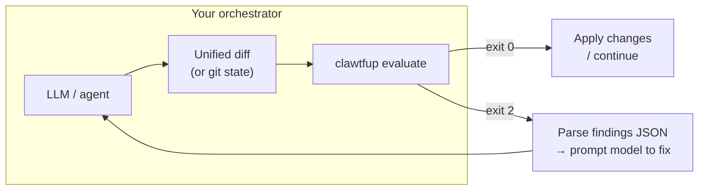

<div align="center">

|  |
|:--:|
|  |

### clawtfup

*Open claws. Closed loopholes.*

[](https://www.python.org/downloads/)
[](LICENSE)
[](https://www.openpolicyagent.org/)

**Workspace in. Unified diff in. JSON verdict out.**

OPA evaluates your tree plus proposed edits—your Rego, your feedback copy, one stdout report.

[AGENTS.md](AGENTS.md) · [Bundled policies](.clawtfup/policies/README.md)

</div>

---

## At a glance

| | |
|:---|:---|
| **What** | Indexes text under your project root, merges **`git diff HEAD`** (or a patch you supply), runs **`.clawtfup/policies/`** through OPA, attaches **`.clawtfup/feedback/`** hints to findings. |
| **Default scan** | **Full tree**—committed code is in scope, not only touched lines. Use `--diff-only` when you intentionally want a narrower check. |
| **CLI** | `clawtfup` · also `python -m policy_eval evaluate …` |
| **Strict** | Exit **2** if `allow` is false or any error-level finding—unless you pass `--no-strict`. |

---

## Install

```bash
pip install -e .
```

You also need **OPA** on `PATH` or a binary at **`tools/opa`**. **Git** is expected if you rely on the default `git diff HEAD`.

---

## Run it

From the **repository root** (or pass `--workspace`):

```bash
clawtfup evaluate --pretty
```

**Success:** exit **0**, stdout is one JSON object with `"allow": true` and no error-severity `findings[]`.

**Failure:** exit **2** (strict). Read `findings[]`, use `feedback.remediation` when present, fix product code, run again.

Pipe a **unified diff** instead of using git’s working tree:

```bash
clawtfup evaluate --diff-file - --pretty < proposed.patch
```

---

## Agents & LLMs

This README is written so tools and humans share the same contract. In short:

1. Run **`clawtfup evaluate --pretty`** before calling a task “done”.
2. Treat stdout JSON as the source of truth; **do not** use `--no-strict` unless a human asked.
3. On failure, implement fixes in **application code**—not by weakening `.clawtfup/` unless the user explicitly changes policy.

Stricter, repo-specific rules: **[AGENTS.md](AGENTS.md)**.

---

## Post-LLM hooks: enforce policy on agent output

Use **clawtfup** *after* the model returns proposed edits and *before* you apply them to disk or merge. The model proposes text; your harness turns that into a **unified diff** (or relies on **git** after staging) and runs the evaluator.



**Patterns that work well**

| Pattern | Idea |
|:--------|:-----|
| **Stdin patch** | After the LLM emits a patch, run `clawtfup evaluate --diff-file - --pretty` and pipe the patch on stdin. `inputs.change_source` will be `stdin`. |
| **Git after apply** | Let the agent edit files, then run `clawtfup evaluate --pretty` so the default `git diff HEAD` reflects those edits against `HEAD`. |
| **Saved diff file** | Write the model’s unified diff to a temp file; `clawtfup evaluate --diff-file /tmp/p.patch --pretty`. |
| **CI / pre-merge** | In GitHub Actions (or similar), run `clawtfup evaluate` on the PR workspace so every merge is gated the same way as local agents. |
| **Editor / agent hooks** | Wire a “after agent turn” or “before save” command in Cursor, Claude Code, or your own runner to shell out to `clawtfup`; block apply when exit code is **2** and pass `findings[]` back into the next model call. |

**Hook contract (keep it boring and reliable)**

- Parse **stdout only** as JSON; stderr is for humans and errors.
- If exit code is **2**, load `findings[]` and feed `message` plus `feedback.remediation` into the next LLM turn until exit **0** or the user aborts.
- For **fast inner loops** on huge repos, consider `--scan-prefix` or (weaker) `--diff-only`—document that choice so agents do not use it to evade full-repo rules without human intent.

clawtfup does **not** ship a vendor-specific hook config; it is a **CLI + library** so any stack that can run a process and read JSON can gate agents.

---

## JSON (fields worth parsing)

| Path | Meaning |
|:-----|:--------|
| `allow` | Policy allow/deny for this snapshot. |
| `findings[]` | Violations; empty is clean. |
| `findings[].code` | Stable id; maps to feedback YAML. |
| `findings[].severity` | `"error"` fails strict; `"warning"` does not. |
| `findings[].message` | Short explanation from Rego. |
| `findings[].path` | File, when relevant. |
| `findings[].feedback` | `title`, `remediation`, `references` when configured. |
| `inputs.changed_paths` | Paths involved in the change slice. |
| `inputs.scan_mode` | `full_tree` / `diff_only` / `prefix`. |
| `inputs.change_source` | `git_head` / `diff_file` / `stdin`. |
| `query_errors` | OPA or query failures—do not treat as success. |

---

## CLI reference

```text
clawtfup evaluate [--workspace DIR] [--diff-file PATH|-] [--diff-only] [--scan-prefix PATH]
  [--input-json PATH] [--query Q] [--max-files N] [--max-file-bytes N] [--exclude-glob G]
  [--no-gitignore] [--pretty] [--no-strict]
```

<details>
<summary><strong>Flags</strong> (click to expand)</summary>

| Flag | Effect |
|:-----|:-------|
| `--workspace` | Project root; policies live in `<workspace>/.clawtfup/policies/`. |
| `--diff-file` / `-` | Unified diff file or stdin (`-`). Default: `git diff HEAD` in the workspace. |
| `--diff-only` | Run policy only on diff-touched paths (legacy / faster, weaker). |
| `--scan-prefix` | Only index and scan under this relative path (e.g. `examples/blog`). |
| `--input-json` | JSON merged into OPA input after the built-in fragment. |
| `--exclude-glob` | Repeatable `fnmatch` on workspace-relative paths (not recursive `**` globstar). |
| `--no-gitignore` | Index paths `.gitignore` would hide (use sparingly). |
| `--pretty` | Pretty-printed JSON on stdout. |
| `--no-strict` | Exit 0 even when denied or errors present (humans / tooling only). |

**Exit codes:** **0** = strict pass · **2** = policy denial or error findings · other = bad input, bundle, or OPA failure.

</details>

---

## Excluding paths

Policy only sees **indexed** files. There is no separate Rego-side ignore file.

| Mechanism | Role |
|:----------|:-----|
| **`.gitignore`** | **On by default.** Ignored files are not indexed. |
| **`--no-gitignore`** | Disable that filter (expect noise unless you also narrow scope). |
| **`--exclude-glob`** | Repeatable shell-style globs on relative paths; deep trees often belong in `.gitignore` instead. |
| **`--scan-prefix`** | Only evaluate under one subtree. |
| **Always skipped** | `.git/` and `.clawtfup/` are never indexed as product source. |

---

## Repo layout

| Path | Role |
|:-----|:-----|
| `.clawtfup/policies/policy_eval.yaml` | OPA queries (and optional `findings_query`). |
| `.clawtfup/policies/rego/*.rego` | Policy rules. |
| `.clawtfup/feedback/*.{yaml,yml,json}` | Human-facing remediation text (merged after OPA). |

---

## Python API

```python
from pathlib import Path
from policy_eval.evaluate import EvaluateOptions, evaluate

report = evaluate(
    EvaluateOptions(
        workspace=Path("/path/to/project"),
        bundle_root=Path("/path/to/project/.clawtfup/policies"),
        patch_text="",
        change_source="git_head",
        index_from_git_head=True,
        full_scan=True,
    )
)
```

`full_scan=True` matches the default CLI (full tree). Set `full_scan=False` for diff-only style evaluation.

---

## Further reading

- [AGENTS.md](AGENTS.md) — mandatory agent behavior in this repository  
- [.clawtfup/policies/README.md](.clawtfup/policies/README.md) — bundled rule set  
- [pyproject.toml](pyproject.toml) — distribution name **`clawtfup`**, import package **`policy_eval`**
