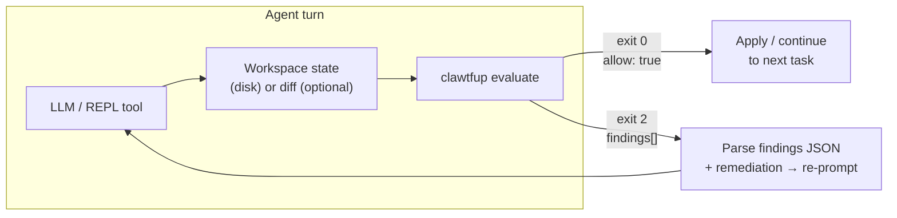

<div align="center">


### clawtfup

*Open claws. Closed loopholes.*

[](https://www.python.org/downloads/)
[](LICENSE)
[](https://www.openpolicyagent.org/)

[](https://claude.ai/code)
[](https://openai.com/codex)
[](https://github.com/google-gemini/gemini-cli)
[](https://github.com/QwenLM/qwen-code)
[](https://kilocode.ai/docs/cli)
[-CLI_proxy-0f172a?style=flat-square)](https://github.com/charmbracelet/crush)
[](https://cursor.com)
[](https://code.visualstudio.com)

**Your LLM agent cannot ship a policy violation. Not accidentally. Not silently. Not ever.**

clawtfup intercepts every agent turn — after the model proposes edits, before anything touches disk — and enforces your Rego policies against the full workspace. A violation blocks the turn cold. The agent receives the finding and its remediation, fixes the code, and tries again. You define the rules once. clawtfup holds the line on every single turn, automatically.

[AGENTS.md](AGENTS.md) · [Bundled policies](.clawtfup/policies/README.md)

</div>

---

## Why clawtfup

Every linter, formatter, and code review bot you've ever used has the same fundamental flaw: they run *after* the code already exists. They advise. They warn. They flag. But the code ships anyway — because nothing is actually stopping it.

LLM agents make this problem an order of magnitude worse. They're fast, autonomous, and confident. They generate code that compiles, passes tests, and *looks* right — while silently violating the architectural layering, security invariants, and syntactic constraints that hold your codebase together. By the time a human or a CI gate catches it, the damage is done: a bad pattern is in the tree, possibly replicated across dozens of files in the same session.

**clawtfup is the first tool that enforces policy at the agent decision layer — not after the fact, but at the exact moment the agent proposes a change.**

It wires into the agent's hook protocol as a **post-LLM / pre-apply gate**. When the model finishes a turn and proposes a set of edits, clawtfup evaluates the full proposed workspace state against your OPA policy bundle before a single byte lands on disk. If the proposal violates policy, the turn is **blocked** — not warned, not flagged for later review, **blocked**. The agent receives the exact finding and its remediation text, corrects the code, and the cycle repeats until the workspace is clean. The agent cannot advance past a violation.

This changes the guarantee entirely. You're no longer hoping your policies get caught in review. You're enforcing them as a hard invariant on every agent action, in real time.

Write your rules once in Rego. Every subsequent agent turn — across every file, every session, every developer on your team — is evaluated against them automatically:

- **Security invariants** — SQL injection via f-strings, unchecked dynamic code execution, TLS verify disabled, secrets in source, CSRF, pickle, unsafe YAML deserialization
- **Architectural constraints** — no database calls in view layers, no circular imports across bounded contexts
- **Syntactic hygiene** — Python 2 leakage, mutable default arguments, bare `except: pass`, dangerous anti-patterns
- **Your own rules** — `.clawtfup/policies/rego/*.rego` is yours; if OPA can express it, clawtfup can enforce it

The feedback loop is designed for autonomy: exit **2** returns structured findings with `code`, `message`, and `remediation` text so the agent knows exactly what to fix and how — not just that something failed.

---

## How it fits in a hook architecture



**Pre-hook vs post-hook.** clawtfup runs *after* the model proposes edits and *before* they land on disk or merge. That makes it a **post-LLM / pre-apply hook**—the natural enforcement point. By default it evaluates the **current disk state** with no diff; you can also pipe in a unified diff to evaluate a proposed change before it's even written. Run it in CI as a **pre-merge gate** to catch anything that slipped through local hooks.

```
┌──────────────────────────────────────────────────────────────────┐
│  Agent (Claude Code · Codex · Gemini · Qwen Code · Kilo · Crush · Cursor · VS Code · Aider) │
│                                                                  │
│  pre-hook      → inject workspace status (UserPromptSubmit /     │
│                  BeforeAgent / beforeSubmitPrompt)               │
│  [LLM turn]    → model edits files                               │
│  post-hook     → clawtfup evaluate ← enforcement point           │
│  on exit 0     → continue / apply / commit                       │
│  on exit 2     → findings + remediation fed back; model fixes    │
└──────────────────────────────────────────────────────────────────┘
```

---

## At a glance

| | |
|:---|:---|
| **Indexes** | Text files under project root (disk walk by default; optional git HEAD baseline only with `--diff-only` and no `--diff-file`). |
| **Applies** | Optional unified diff (`--diff-file` or stdin). Default full scan uses **no** diff—current files on disk are the evaluated state. |
| **Evaluates** | Your `.clawtfup/policies/` Rego bundle via OPA against the full workspace. |
| **Enriches** | Findings with `.clawtfup/feedback/` remediation text and references. |
| **Default scan** | **Full tree** over the working tree. Exclusions: **`.cfupignore`** (gitignore syntax, on by default), optional **`.gitignore`** via `--use-gitignore`. Use `--diff-only` for a narrower diff-scoped check. |
| **Strict mode** | Exit **2** if `allow` is false or any error-level finding—unless `--no-strict`. |

---

## Install

```bash
pip install -e .
```

You also need **OPA** on `PATH` or a binary at **`tools/opa`**. **Git** is only required for **`--diff-only`** when you do not pass **`--diff-file`** (that mode still uses `git diff HEAD`).

---

## Quickstart

Run from the **repository root** (or pass `--workspace`):

```bash
clawtfup evaluate --pretty
```

**Pass:** exit **0**, JSON with `"allow": true` and no error-severity `findings[]`.

**Fail:** exit **2** (strict). Read `findings[]`, use `feedback.remediation` when present, fix application code, run again.

Pipe a **unified diff** directly (no git state needed):

```bash
clawtfup evaluate --diff-file - --pretty < proposed.patch
```

---

## Wiring into agents and REPL tools

###  Claude Code

[](https://docs.anthropic.com/en/docs/claude-code/hooks)
[](https://docs.anthropic.com/en/docs/claude-code/hooks)
[](https://docs.anthropic.com/en/docs/claude-code)

clawtfup ships **protocol-aware hook commands** that speak the Claude Code hook JSON protocol natively. Unlike a raw shell command, they read the hook event from stdin, evaluate the workspace, and return a structured response Claude Code understands—blocking the turn, injecting context, or silently passing.

#### Setup

The hooks delegate to shell scripts that handle both venv and global installs. Copy the three files below into your project exactly as shown.

**`.claude/settings.json`**

```json
{
  "hooks": {
    "PostToolUse": [
      {
        "matcher": "",
        "hooks": [
          {
            "type": "command",
            "command": "\"$CLAUDE_PROJECT_DIR\"/.claude/hooks/clawtfup-post-tool-use.sh"
          }
        ]
      }
    ],
    "UserPromptSubmit": [
      {
        "hooks": [
          {
            "type": "command",
            "command": "\"$CLAUDE_PROJECT_DIR\"/.claude/hooks/clawtfup-user-prompt-submit.sh"
          }
        ]
      }
    ]
  }
}
```

> **`"matcher": ""`** matches every tool without exception—`Edit`, `Write`, `MultiEdit`, `Bash`, `NotebookEdit`, and any future tools. Narrowing the matcher creates blind spots.

**`.claude/hooks/clawtfup-post-tool-use.sh`** (chmod +x)

```bash
#!/usr/bin/env bash
set -euo pipefail
ROOT="${CLAUDE_PROJECT_DIR:-}"
if [[ -z "$ROOT" ]]; then exit 0; fi
cd "$ROOT" || exit 0
if [[ -x .venv/bin/python ]]; then
  exec .venv/bin/python -m policy_eval hook-post-tool-use
fi
if command -v clawtfup >/dev/null 2>&1; then
  exec clawtfup hook-post-tool-use
fi
exit 0
```

**`.claude/hooks/clawtfup-user-prompt-submit.sh`** (chmod +x)

```bash
#!/usr/bin/env bash
set -euo pipefail
ROOT="${CLAUDE_PROJECT_DIR:-}"
if [[ -z "$ROOT" ]]; then exit 0; fi
cd "$ROOT" || exit 0
if [[ -x .venv/bin/python ]]; then
  exec .venv/bin/python -m policy_eval hook-user-prompt-submit
fi
if command -v clawtfup >/dev/null 2>&1; then
  exec clawtfup hook-user-prompt-submit
fi
exit 0
```

The scripts resolve the runtime in order: **project venv** (`.venv/bin/python`) → **global `clawtfup`** on `PATH`. If neither is found they exit 0 silently, so the hooks are safe to commit to repos where clawtfup isn't yet installed.

```bash
chmod +x .claude/hooks/clawtfup-post-tool-use.sh \
         .claude/hooks/clawtfup-user-prompt-submit.sh
```

#### How the hooks work

**`clawtfup hook-post-tool-use`** 

Fires after every tool call. The hook reads the Claude Code event JSON from stdin (which supplies the working directory), runs `clawtfup evaluate` against that workspace, and responds with a decision:

- **Policy pass** → returns empty stdout, exit 0. The tool call proceeds normally.
- **Policy fail** → returns a JSON block with `"decision": "block"` and a compact findings summary injected into `additionalContext`. Claude Code pauses the turn and shows the agent the violations. The agent receives remediation text and fixes the code before the turn resumes.

```
POST TOOL USE (Edit/Write)
        │
        ▼
clawtfup hook-post-tool-use ──reads stdin event──▶ runs evaluate
        │
        ├── pass  ──▶ empty stdout, exit 0  ──▶ Claude continues
        │
        └── fail  ──▶ {"decision":"block","hookSpecificOutput":
                        {"additionalContext":"<findings + remediation>"}}
                       Claude pauses, agent reads findings, re-edits
```

**`clawtfup hook-user-prompt-submit`** 

Fires at the start of every user prompt, before the model responds. It evaluates the current workspace and injects a single-line summary into the agent's context window via `additionalContext`. It **never blocks**:

- **Workspace clean** → `"clawtfup: evaluate passed … run clawtfup evaluate --pretty before finishing."`
- **Workspace dirty** → `"clawtfup: evaluate FAILS. Fix before adding more changes."` followed by a compact findings list.

This keeps the agent continuously aware of the policy state without interrupting the user's message. If the agent enters a broken workspace, it knows before it writes a single line of code.

#### Protocol detail

Both commands write JSON to stdout using the [Claude Code hook output format](https://docs.anthropic.com/en/docs/claude-code/hooks). The payload shape for a block:

```json
{
  "decision": "block",
  "reason": "clawtfup: policy failed (1 error)",
  "suppressOutput": true,
  "hookSpecificOutput": {
    "additionalContext": "- [SQL_FSTRING_QUERY] SQL query built with f-string interpolation (src/db/queries.py)\n  → Use parameterised queries..."
  }
}
```

`additionalContext` is capped at 10 000 characters and lists at most 6 findings so it never saturates the model's context window. Both hooks skip silently (exit 0, no output) when `.clawtfup/policies/` does not exist in the workspace—safe to commit to repos that don't yet use clawtfup.

#### CLI proxy (transparent agent wrapping) 

For scripted orchestration or environments where you launch Claude Code programmatically, clawtfup can act as a **transparent subprocess relay**:

```bash
clawtfup cli --provider claude -- --dangerously-skip-permissions -p "Fix the auth layer"
```

This spawns the `claude` binary (or `$CLAWTFUP_CLAUDE_BIN`) with the given arguments and relays all I/O transparently. On a real terminal it opens a PTY—giving the child process full TUI support with terminal size syncing and signal forwarding (including `SIGWINCH`). In a non-TTY context (pipes, CI, scripted runners) it falls back to a three-thread pipe relay for clean stdout/stderr separation.

Policy enforcement in this mode still comes from the `.claude/settings.json` hooks above—the proxy only relays I/O and returns the child's exit code unchanged.

```bash
# Override the Claude binary
CLAWTFUP_CLAUDE_BIN=/usr/local/bin/claude clawtfup cli --provider claude -- --help
```

Or use the bundled slash command at `.claude/commands/noshit.md` which wraps any task description and enforces the gate before marking the task complete.

---

###  OpenAI Codex

[](https://developers.openai.com/codex/hooks/)
[](https://developers.openai.com/codex/hooks/)
[]()

Codex ships a native hook protocol that mirrors Claude Code's exactly — the same `PostToolUse` and `UserPromptSubmit` events, the same JSON contract on stdin, and the same `decision: block` / `additionalContext` response shape. clawtfup speaks this protocol natively via dedicated Codex hook commands, giving you turn-level blocking and ambient context injection with zero custom glue code.

> **Note:** Codex hooks are experimental and currently [disabled on Windows](https://developers.openai.com/codex/hooks/) as of upstream docs. Linux and macOS are fully supported.

#### Setup

**Step 1 — Enable hooks in `config.toml`**

Add the following to your user-level (`~/.codex/config.toml`) or project-level (`<repo>/.codex/config.toml`) config:

```toml
[features]
codex_hooks = true
```

**Step 2 — Wire the hook commands**

Copy or merge [`.codex/hooks.json`](.codex/hooks.json) into your Codex config search path (`~/.codex/hooks.json` or `<repo>/.codex/hooks.json`):

```json
{
  "hooks": {
    "PostToolUse": [
      {
        "matcher": "",
        "hooks": [
          {
            "type": "command",
            "command": "bash \"$(git rev-parse --show-toplevel)/.codex/hooks/clawtfup-codex-post-tool-use.sh\"",
            "statusMessage": "clawtfup: policy after tool use"
          }
        ]
      }
    ],
    "UserPromptSubmit": [
      {
        "hooks": [
          {
            "type": "command",
            "command": "bash \"$(git rev-parse --show-toplevel)/.codex/hooks/clawtfup-codex-user-prompt-submit.sh\""
          }
        ]
      }
    ]
  }
}
```

> **`"matcher": ""`** matches every tool without exception. Narrowing the matcher creates blind spots.

**Step 3 — Copy the shell wrappers**

Copy [`.codex/hooks/clawtfup-codex-post-tool-use.sh`](.codex/hooks/clawtfup-codex-post-tool-use.sh) and [`.codex/hooks/clawtfup-codex-user-prompt-submit.sh`](.codex/hooks/clawtfup-codex-user-prompt-submit.sh) into your project.

**`.codex/hooks/clawtfup-codex-post-tool-use.sh`** (chmod +x)

```bash
#!/usr/bin/env bash
set -euo pipefail
ROOT="$(git rev-parse --show-toplevel 2>/dev/null || true)"
if [[ -z "$ROOT" ]]; then exit 0; fi
cd "$ROOT" || exit 0
if [[ -x .venv/bin/python ]]; then
  exec .venv/bin/python -m policy_eval hook-codex-post-tool-use
fi
if command -v clawtfup >/dev/null 2>&1; then
  exec clawtfup hook-codex-post-tool-use
fi
exit 0
```

**`.codex/hooks/clawtfup-codex-user-prompt-submit.sh`** (chmod +x)

```bash
#!/usr/bin/env bash
set -euo pipefail
ROOT="$(git rev-parse --show-toplevel 2>/dev/null || true)"
if [[ -z "$ROOT" ]]; then exit 0; fi
cd "$ROOT" || exit 0
if [[ -x .venv/bin/python ]]; then
  exec .venv/bin/python -m policy_eval hook-codex-user-prompt-submit
fi
if command -v clawtfup >/dev/null 2>&1; then
  exec clawtfup hook-codex-user-prompt-submit
fi
exit 0
```

The scripts resolve the runtime in order: **project venv** (`.venv/bin/python`) → **global `clawtfup`** on `PATH`. If neither is found they exit 0 silently — safe to commit to repos where clawtfup isn't yet installed.

```bash
chmod +x .codex/hooks/clawtfup-codex-post-tool-use.sh \
         .codex/hooks/clawtfup-codex-user-prompt-submit.sh
```

#### How the hooks work

**`clawtfup hook-codex-post-tool-use`** 

Fires after every tool call. Reads the Codex hook event JSON from stdin, runs `clawtfup evaluate` against the workspace, and responds with a decision:

- **Policy pass** → empty stdout, exit 0. The tool call proceeds normally.
- **Policy fail** → JSON with `"decision": "block"` and a compact findings summary in `additionalContext`. Codex pauses the turn; the agent receives the violations and remediation text, fixes the code, and the turn resumes.

```
POST TOOL USE (file edit / shell command)
        │
        ▼
clawtfup hook-codex-post-tool-use ──reads stdin event──▶ runs evaluate
        │
        ├── pass  ──▶ empty stdout, exit 0  ──▶ Codex continues
        │
        └── fail  ──▶ {"decision":"block","hookSpecificOutput":
                        {"additionalContext":"<findings + remediation>"}}
                       Codex pauses, agent reads findings, re-edits
```

**`clawtfup hook-codex-user-prompt-submit`** 

Fires at the start of every user prompt, before the model responds. Evaluates the current workspace and injects a one-line status into the agent's context via `additionalContext`. It **never blocks**:

- **Workspace clean** → `"clawtfup: evaluate passed … run clawtfup evaluate --pretty before finishing."`
- **Workspace dirty** → `"clawtfup: evaluate FAILS. Fix before adding more changes."` followed by a compact findings list.

The agent enters every turn already aware of the workspace policy state — it knows about violations before writing a single line of code.

#### Protocol detail

Both commands speak the same JSON protocol as the Claude Code hooks. The block payload shape:

```json
{
  "decision": "block",
  "reason": "clawtfup: policy failed (1 error)",
  "suppressOutput": true,
  "hookSpecificOutput": {
    "additionalContext": "- [SQL_FSTRING_QUERY] SQL query built with f-string interpolation (src/db/queries.py)\n  → Use parameterised queries..."
  }
}
```

`additionalContext` is capped at 10 000 characters and lists at most 6 findings. Both hooks exit 0 silently when `.clawtfup/policies/` does not exist.

#### CLI proxy (transparent agent wrapping) 

For scripted orchestration or non-interactive pipelines, clawtfup can wrap the Codex binary as a **transparent subprocess relay**:

```bash
clawtfup cli --provider codex -- exec "Fix the auth layer"
```

Spawns the `codex` binary (or `$CLAWTFUP_CODEX_BIN`) with the given arguments and relays all I/O transparently. On a real terminal it opens a PTY for full TUI support with terminal size syncing and signal forwarding. In non-TTY contexts (pipes, CI) it falls back to a three-thread pipe relay.

Policy enforcement in this mode still comes from `hooks.json` — the proxy only relays I/O and returns the child's exit code unchanged.

```bash
# Override the Codex binary
CLAWTFUP_CODEX_BIN=/opt/homebrew/bin/codex clawtfup cli --provider codex -- --help
```

---

###  Gemini CLI

[](https://github.com/google-gemini/gemini-cli/blob/main/docs/hooks/reference.md)
[](https://github.com/google-gemini/gemini-cli/blob/main/docs/hooks/reference.md)
[]()

The [Gemini CLI](https://github.com/google-gemini/gemini-cli) hook system uses **`AfterTool`** (after a tool runs) and **`BeforeAgent`** (after the user submits a prompt, before planning)—the same JSON on stdin (`cwd`, `hook_event_name`, …) and stdout as other lifecycle hooks in that tool. clawtfup maps them to **`hook-gemini-after-tool`** and **`hook-gemini-before-agent`**: evaluate on failure after a tool yields `decision: "deny"` plus `hookSpecificOutput.additionalContext` (per the [hooks reference](https://github.com/google-gemini/gemini-cli/blob/main/docs/hooks/reference.md)); BeforeAgent only injects context and never denies the prompt.

#### Setup

**Step 1 — Wire hooks in `settings.json`**

Copy or merge [`.gemini/settings.json`](.gemini/settings.json) into your project (or merge the `hooks` object into an existing `~/.gemini/settings.json` / `<repo>/.gemini/settings.json`).

**Step 2 — Copy the shell wrappers**

Copy [`.gemini/hooks/clawtfup-gemini-after-tool.sh`](.gemini/hooks/clawtfup-gemini-after-tool.sh) and [`.gemini/hooks/clawtfup-gemini-before-agent.sh`](.gemini/hooks/clawtfup-gemini-before-agent.sh) into your project, then:

```bash
chmod +x .gemini/hooks/clawtfup-gemini-after-tool.sh \
         .gemini/hooks/clawtfup-gemini-before-agent.sh
```

The wrappers resolve the repo root via `git rev-parse --show-toplevel`, then run `python -m policy_eval hook-gemini-after-tool` / `hook-gemini-before-agent` (or `clawtfup` on `PATH`).

#### CLI proxy

```bash
clawtfup cli --provider gemini -- --help
```

Spawns the `gemini` binary (or `$CLAWTFUP_GEMINI_BIN`) with PTY relay on an interactive terminal, same as Claude and Codex. Policy still comes from `.gemini/settings.json` hooks.

```bash
CLAWTFUP_GEMINI_BIN=/path/to/gemini clawtfup cli --provider gemini -- --help
```

---

###  Qwen Code CLI

[](https://github.com/QwenLM/qwen-code/blob/main/docs/users/features/hooks.md)
[](https://github.com/QwenLM/qwen-code/blob/main/docs/users/features/hooks.md)
[](https://github.com/QwenLM/qwen-code/blob/main/docs/users/features/hooks.md)
[]()

[Qwen Code](https://github.com/QwenLM/qwen-code) uses the same lifecycle names as Claude Code — **`PostToolUse`**, **`UserPromptSubmit`**, and **`Stop`** — with hook JSON on stdin (`cwd`, `hook_event_name`, …) as documented in [hooks.md](https://github.com/QwenLM/qwen-code/blob/main/docs/users/features/hooks.md). Configure hooks in **`.qwen/settings.json`**. Three events give you full session coverage:

- **`PostToolUse`** → **`hook-qwen-post-tool-use`**: blocks the turn on policy failure. Uses Codex-style response (no `suppressOutput`).
- **`UserPromptSubmit`** → **`hook-qwen-user-prompt-submit`**: injects workspace status before the model responds; never blocks.
- **`Stop`** → **`hook-qwen-stop`**: final gate. On failure emits **top-level** `"decision": "block"` + `"reason"` per [Qwen’s documented shape](https://github.com/QwenLM/qwen-code/blob/main/docs/users/features/hooks.md) (distinct from VS Code’s `hookSpecificOutput` wrapper). Guards against retry loops via `stop_hook_active`.

#### Setup

**`.qwen/settings.json`**

```json
{
  "hooks": {
    "PostToolUse": [
      {
        "matcher": "",
        "hooks": [
          {
            "name": "clawtfup-policy-post-tool",
            "type": "command",
            "command": "bash \"$(git rev-parse --show-toplevel)/.qwen/hooks/clawtfup-qwen-post-tool-use.sh\"",
            "description": "clawtfup: policy after tool use"
          }
        ]
      }
    ],
    "UserPromptSubmit": [
      {
        "hooks": [
          {
            "name": "clawtfup-eval-context",
            "type": "command",
            "command": "bash \"$(git rev-parse --show-toplevel)/.qwen/hooks/clawtfup-qwen-user-prompt-submit.sh\""
          }
        ]
      }
    ],
    "Stop": [
      {
        "hooks": [
          {
            "name": "clawtfup-policy-stop",
            "type": "command",
            "command": "bash \"$(git rev-parse --show-toplevel)/.qwen/hooks/clawtfup-qwen-stop.sh\""
          }
        ]
      }
    ]
  }
}
```

> **`"matcher": ""`** matches every tool. Narrowing the matcher creates blind spots.

Copy the shell wrappers from [`.qwen/hooks/`](.qwen/hooks/) into your project:

**`.qwen/hooks/clawtfup-qwen-post-tool-use.sh`** (chmod +x)

```bash
#!/usr/bin/env bash
set -euo pipefail
ROOT="$(git rev-parse --show-toplevel 2>/dev/null || true)"
if [[ -z "$ROOT" ]]; then exit 0; fi
cd "$ROOT" || exit 0
if [[ -x .venv/bin/python ]]; then
  exec .venv/bin/python -m policy_eval hook-qwen-post-tool-use
fi
if command -v clawtfup >/dev/null 2>&1; then
  exec clawtfup hook-qwen-post-tool-use
fi
exit 0
```

**`.qwen/hooks/clawtfup-qwen-user-prompt-submit.sh`** (chmod +x)

```bash
#!/usr/bin/env bash
set -euo pipefail
ROOT="$(git rev-parse --show-toplevel 2>/dev/null || true)"
if [[ -z "$ROOT" ]]; then exit 0; fi
cd "$ROOT" || exit 0
if [[ -x .venv/bin/python ]]; then
  exec .venv/bin/python -m policy_eval hook-qwen-user-prompt-submit
fi
if command -v clawtfup >/dev/null 2>&1; then
  exec clawtfup hook-qwen-user-prompt-submit
fi
exit 0
```

**`.qwen/hooks/clawtfup-qwen-stop.sh`** (chmod +x)

```bash
#!/usr/bin/env bash
set -euo pipefail
ROOT="$(git rev-parse --show-toplevel 2>/dev/null || true)"
if [[ -z "$ROOT" ]]; then exit 0; fi
cd "$ROOT" || exit 0
if [[ -x .venv/bin/python ]]; then
  exec .venv/bin/python -m policy_eval hook-qwen-stop
fi
if command -v clawtfup >/dev/null 2>&1; then
  exec clawtfup hook-qwen-stop
fi
exit 0
```

The scripts resolve runtime in order: **project venv** → **global `clawtfup`** on `PATH`. Exit 0 silently when neither is found — safe to commit to repos not yet using clawtfup.

```bash
chmod +x .qwen/hooks/clawtfup-qwen-post-tool-use.sh \
         .qwen/hooks/clawtfup-qwen-user-prompt-submit.sh \
         .qwen/hooks/clawtfup-qwen-stop.sh
```

#### How the hooks work

**`clawtfup hook-qwen-post-tool-use`** 

Fires after every tool call. Reads the Qwen hook event from stdin, evaluates the workspace, and returns:

- **Pass** → empty stdout, exit 0.
- **Fail** → `{"decision": "block", "hookSpecificOutput": {"additionalContext": "<findings>"}}`.

**`clawtfup hook-qwen-user-prompt-submit`** 

Fires before the model responds to each prompt. Injects a one-line workspace status into `additionalContext`. Never blocks.

**`clawtfup hook-qwen-stop`** 

Fires when the agent session ends. On failure returns top-level `decision: "block"` + `reason` (Qwen’s documented `Stop` shape — distinct from the `hookSpecificOutput` wrapper used by VS Code). Retry-loop guard: no-ops when `stop_hook_active` is true.

```
Qwen Code session
        │
        ├─ [user submits prompt]  →  hook-qwen-user-prompt-submit  (inject status, never block)
        │
        ├─ [model edits a file]   →  hook-qwen-post-tool-use       (block on violation)
        │
        └─ [session ends]         →  hook-qwen-stop                (final gate; block if dirty)
```

#### CLI proxy (transparent agent wrapping) 

```bash
clawtfup cli --provider qwen -- --help
```

Spawns the `qwen` binary (from `@qwen-code/qwen-code`, or `$CLAWTFUP_QWEN_BIN`) with PTY relay on an interactive terminal; falls back to pipe relay in non-TTY contexts. Policy enforcement still comes from `.qwen/settings.json` hooks — the proxy only relays I/O.

```bash
CLAWTFUP_QWEN_BIN=/path/to/qwen clawtfup cli --provider qwen -- --help
```

---

###  Kilocode & OpenCode (`kilo`)

[](https://opencode.ai/docs/plugins)
[](https://opencode.ai/docs/plugins)
[]()

[Kilocode](https://kilocode.ai/docs/cli) ships the **`kilo`** CLI (`npm i -g @kilocode/cli`), a fork of [OpenCode](https://opencode.ai/) that shares the same **JavaScript plugin** model. Unlike the other providers there is no stdin/JSON shell-hook channel — policy is enforced via a project plugin file that subscribes to the **`tool.execute.after`** lifecycle event.

```
Kilo / OpenCode session
        │
        ├─ [model runs a tool]
        │        │
        │        ▼
        │  tool.execute.after  ──▶  clawtfup evaluate (strict)
        │        │
        │        ├── exit 0  ──▶  tool result returned to model; session continues
        │        │
        │        └── exit ≠ 0  ──▶  plugin throws Error with findings + remediation
        │                           agent sees violation text, must fix before continuing
        │
        └─ [repeat for every tool call in the session]
```

#### Setup

Copy **`.opencode/plugins/`** into your project root. OpenCode and Kilo auto-load all `.mjs` files in that directory — no manifest entry required. Config precedence for Kilo follows `~/.config/kilo/opencode.json` → project `opencode.json` → `.opencode/`.

**`.opencode/plugins/clawtfup-policy.mjs`**

```js
import { spawnSync } from "node:child_process"
import { existsSync } from "node:fs"
import { join } from "node:path"
import { platform } from "node:os"

function clawtfupExecutable(root) {
  if (platform() === "win32") {
    const p = join(root, ".venv", "Scripts", "clawtfup.exe")
    if (existsSync(p)) return p
  } else {
    const p = join(root, ".venv", "bin", "clawtfup")
    if (existsSync(p)) return p
  }
  return "clawtfup"
}

export const ClawtfupPolicy = async ({ directory }) => {
  if (!existsSync(join(directory, ".clawtfup", "policies"))) return {}
  const exe = clawtfupExecutable(directory)
  return {
    "tool.execute.after": async (input) => {
      const tool = input?.tool ?? "tool"
      const result = spawnSync(exe, ["evaluate"], {
        cwd: directory, encoding: "utf-8", maxBuffer: 12 * 1024 * 1024,
      })
      if (result.error) throw new Error(
        `clawtfup: could not run (${result.error.message}). Install clawtfup or fix PATH.`
      )
      if (result.status === 0) return
      const out = [result.stdout, result.stderr].filter(Boolean).join("\n").trim()
      const clip = out.length > 10000
        ? `${out.slice(0, 10000)}\n...(truncated; run clawtfup evaluate --pretty locally.)`
        : out
      throw new Error(`clawtfup: policy failed after ${tool}. Fix findings then retry.\n\n${clip}`)
    },
  }
}
```

**How it works:**

- **`.clawtfup/policies/` absent** → plugin returns `{}` (no-op; safe to commit to repos not yet using clawtfup).
- **`.clawtfup/policies/` present** → after every tool call the plugin runs `clawtfup evaluate` (strict) in the workspace root.
- **Pass** (exit 0) → plugin returns normally; session continues.
- **Fail** (exit ≠ 0) → plugin throws `Error` with up to 10 000 characters of findings + remediation. Kilo / OpenCode surfaces the error to the model, which must fix the violations before the session can advance.

Runtime resolution: **`.venv/bin/clawtfup`** (or `.venv/Scripts/clawtfup.exe` on Windows) → **`clawtfup`** on `PATH`.

#### CLI proxy (transparent agent wrapping) 

```bash
clawtfup cli --provider kilo -- --help
```

Spawns **`kilo`** (or **`$CLAWTFUP_KILO_BIN`**) with the same PTY/pipe relay as other providers. Policy enforcement comes from the plugin above — the proxy only wraps the binary.

```bash
CLAWTFUP_KILO_BIN=/path/to/kilo clawtfup cli --provider kilo -- run "Fix the auth layer"
```

---

###  Charm Crush (`crush`)

[]()
[]()
[](https://charm.land/crush.json)

[Crush](https://github.com/charmbracelet/crush) is Charm’s terminal coding agent (`brew install charmbracelet/tap/crush` or `npm i -g @charmland/crush`).

The published [`crush.json` schema](https://charm.land/crush.json) configures models, MCP, LSP, and tools — it does **not** define a stdin/JSON lifecycle hook channel like Claude Code or Qwen. clawtfup does not ship Crush-specific hook shims; enforcement uses two complementary approaches instead.

#### Approach 1 — `CRUSH.md` context injection

Crush loads `CRUSH.md` from the project root as standing instructions for every session (same pattern as `CLAUDE.md` for Claude Code). Create **`CRUSH.md`** to make the policy gate part of every task:

```markdown
# Policy gate

Before marking any coding task as complete, run:

    clawtfup evaluate --pretty

- Exit **0** → workspace is clean; task is done.
- Exit **2** → read `findings[]`, fix **application code** to satisfy each
  violation, re-run until clean.
- Do not pass `--no-strict` to skip a violation.
- Do not edit `.clawtfup/policies/` or `.clawtfup/feedback/` to weaken rules
  unless the user explicitly asks.
```

Crush reads this on startup and honours it as a standing rule across the entire session. Combine with `AGENTS.md` (which clawtfup also ships) for redundant coverage.

#### Approach 2 — manual gate in workflow

Run `clawtfup evaluate --pretty` from your shell directly after a Crush session ends or at a natural checkpoint:

```bash
# After crush finishes a task
clawtfup evaluate --pretty
# On failure, show the agent what to fix:
clawtfup evaluate --pretty | jq ‘.findings[] | {code, message, remediation: .feedback.remediation}’
```

#### CLI proxy (transparent agent wrapping) 

```bash
clawtfup cli --provider crush -- .
```

Spawns **`crush`** (or **`$CLAWTFUP_CRUSH_BIN`**) with the same PTY/pipe relay as other providers — full TUI support on an interactive terminal, pipe relay in scripted contexts. The proxy validates `.clawtfup/policies/` exists before spawning and returns the child’s exit code unchanged.

```bash
CLAWTFUP_CRUSH_BIN=/path/to/crush clawtfup cli --provider crush -- .
```

> When Charm publishes a documented hook API in `crush.json`, clawtfup will add native hook shims. Until then, `CRUSH.md` + the proxy is the recommended integration.

---

###  Google Antigravity & VS Code agent hooks

[](https://code.visualstudio.com/docs/copilot/customization/hooks)
[](https://code.visualstudio.com/docs/copilot/customization/hooks)
[](https://code.visualstudio.com/docs/copilot/customization/hooks)

[Google Antigravity](https://antigravity.im/documentation) is a VS Code–based agentic IDE. **VS Code (Preview)** loads workspace hooks from [`.github/hooks/*.json`](https://code.visualstudio.com/docs/copilot/customization/hooks) with the same lifecycle names as Claude Code (`PostToolUse`, `UserPromptSubmit`, `Stop`, …). clawtfup ships [`.github/hooks/clawtfup.json`](.github/hooks/clawtfup.json) plus shell wrappers:

- **`PostToolUse` / `UserPromptSubmit`** → `hook-codex-post-tool-use` and `hook-codex-user-prompt-submit` (no `suppressOutput`; matches VS Code’s PostToolUse JSON examples). Stdin may use **`hookEventName`** (camelCase); clawtfup accepts that as well as `hook_event_name`.
- **`Stop`** → **`hook-vscode-stop`**: if evaluate fails, stdout JSON uses `hookSpecificOutput.decision: "block"` and `reason` so the session cannot end until policy passes. When `stop_hook_active` is already true, the hook no-ops to avoid retry loops (per VS Code docs).

#### Setup

Copy [`.github/hooks/clawtfup.json`](.github/hooks/clawtfup.json) and the [`clawtfup-vscode-*.sh`](.github/hooks/) scripts into your repo, then:

```bash
chmod +x .github/hooks/clawtfup-vscode-post-tool-use.sh \
         .github/hooks/clawtfup-vscode-user-prompt-submit.sh \
         .github/hooks/clawtfup-vscode-stop.sh
```

Ensure **Agent hooks** are enabled in the product (VS Code: Copilot agent hooks preview; Antigravity: follow current release notes). Hook discovery uses the default `chat.hookFilesLocations` unless you customize it.

---

###  Cursor

[](https://cursor.com/docs/agent/hooks)
[](https://cursor.com/docs/agent/hooks)
[](https://cursor.com/docs/agent/hooks)
[]()

clawtfup ships **protocol-aware hook commands** for Cursor's native [lifecycle hook system](https://cursor.com/docs/agent/hooks). Three events are covered: prompt submission is gated before the model responds, every file edit is evaluated immediately after it lands, and the completed agent run is blocked on failure. The agent cannot finish a session with a policy violation.

#### Setup

**Step 1 — Wire the hook commands**

Copy or merge [`.cursor/hooks.json`](.cursor/hooks.json) into your project root (or `~/.cursor/hooks.json` for a global gate):

```json
{
  "version": 1,
  "hooks": {
    "beforeSubmitPrompt": [
      { "command": "hooks/clawtfup-cursor-before-submit-prompt.sh" }
    ],
    "afterFileEdit": [
      { "command": "hooks/clawtfup-cursor-after-file-edit.sh" }
    ],
    "stop": [
      { "command": "hooks/clawtfup-cursor-stop.sh" }
    ]
  }
}
```

> Hook paths are resolved relative to the `.cursor/` directory. The shell scripts must live at `.cursor/hooks/`.

**Step 2 — Copy the shell wrappers**

**`.cursor/hooks/clawtfup-cursor-before-submit-prompt.sh`** (chmod +x)

```bash
#!/usr/bin/env bash
set -euo pipefail
ROOT="$(git rev-parse --show-toplevel 2>/dev/null || true)"
if [[ -n "$ROOT" ]]; then cd "$ROOT" || true; fi
if [[ -x .venv/bin/python ]]; then
  exec .venv/bin/python -m policy_eval hook-cursor-before-submit-prompt
fi
if command -v clawtfup >/dev/null 2>&1; then
  exec clawtfup hook-cursor-before-submit-prompt
fi
printf '%s' '{"continue":true}'
exit 0
```

**`.cursor/hooks/clawtfup-cursor-after-file-edit.sh`** (chmod +x)

```bash
#!/usr/bin/env bash
set -euo pipefail
ROOT="$(git rev-parse --show-toplevel 2>/dev/null || true)"
if [[ -n "$ROOT" ]]; then cd "$ROOT" || true; fi
if [[ -x .venv/bin/python ]]; then
  exec .venv/bin/python -m policy_eval hook-cursor-after-file-edit
fi
if command -v clawtfup >/dev/null 2>&1; then
  exec clawtfup hook-cursor-after-file-edit
fi
exit 0
```

**`.cursor/hooks/clawtfup-cursor-stop.sh`** (chmod +x)

```bash
#!/usr/bin/env bash
set -euo pipefail
ROOT="$(git rev-parse --show-toplevel 2>/dev/null || true)"
if [[ -n "$ROOT" ]]; then cd "$ROOT" || true; fi
if [[ -x .venv/bin/python ]]; then
  exec .venv/bin/python -m policy_eval hook-cursor-stop
fi
if command -v clawtfup >/dev/null 2>&1; then
  exec clawtfup hook-cursor-stop
fi
exit 0
```

The scripts resolve the runtime in order: **project venv** (`.venv/bin/python`) → **global `clawtfup`** on `PATH`. If neither is found they exit 0 silently — safe to commit to repos where clawtfup isn't yet installed.

```bash
chmod +x .cursor/hooks/clawtfup-cursor-before-submit-prompt.sh \
         .cursor/hooks/clawtfup-cursor-after-file-edit.sh \
         .cursor/hooks/clawtfup-cursor-stop.sh
```

#### How the hooks work

**`clawtfup hook-cursor-before-submit-prompt`** 

Fires before the user's prompt is sent to the model. Evaluates the workspace and returns a Cursor hook response:

- **Policy pass** → `{"continue": true}`. The prompt is sent normally.
- **Policy fail** → `{"continue": false, "userMessage": "<findings + remediation>"}`. Cursor surfaces the violations to the user and blocks the prompt from being submitted until the workspace is clean.

```
USER SUBMITS PROMPT
        │
        ▼
clawtfup hook-cursor-before-submit-prompt ──▶ runs evaluate
        │
        ├── pass  ──▶ {"continue": true}   ──▶ prompt sent to model
        │
        └── fail  ──▶ {"continue": false, "userMessage": "<findings>"}
                       Cursor blocks prompt; user sees violations, fixes code
```

**`clawtfup hook-cursor-after-file-edit`** 

Fires after each AI file edit. Evaluates the workspace immediately and writes compact findings to **stderr** (visible in **Output → Hooks**) on failure:

- **Policy pass** → exit 0, no output.
- **Policy fail** → exits **2**, findings written to stderr. The agent session may continue, but violations are surfaced in the Hooks output channel in real time.

**`clawtfup hook-cursor-stop`** 

Fires when the agent run finishes. Only acts when `status == "completed"` — the final enforcement gate before the session closes:

- **Policy pass** → exit 0.
- **Policy fail** → exits **2**, compact findings to stderr. The hook run is marked failed, making the policy violation visible in the session summary.

#### Hook coverage across the agent lifecycle

```
Cursor agent session
        │
        ├─ [user types prompt]
        │        │
        │        ▼
        │  beforeSubmitPrompt ──▶ evaluate; block prompt on fail (continue: false)
        │
        ├─ [model edits a file]
        │        │
        │        ▼
        │  afterFileEdit ──────▶ evaluate; exit 2 + stderr findings on fail
        │
        ├─ [model edits another file] ──▶ afterFileEdit fires again
        │
        └─ [agent run completes]
                 │
                 ▼
           stop (completed) ──▶ evaluate; exit 2 on fail — final hard gate
```

Every stage of the session is covered: prompts are gated at submission, edits are checked as they land, and the completed run is blocked if anything slipped through.

#### Agent Rules (`.cursor/rules`) — ambient context

Pair the hooks with a `.cursor/rules` MDC file to keep the model continuously aware of the policy contract. Rules inject context into every chat and Composer session automatically.

Create **`.cursor/rules/clawtfup.mdc`**:

```markdown
---
description: clawtfup policy gate — apply on every coding task
alwaysApply: true
---

## Policy gate (clawtfup)

Before marking **any** coding task as complete you must run:

    clawtfup evaluate --pretty

- Exit **0** → workspace is clean, task is done.
- Exit **2** → read `findings[]`, fix **application code** to satisfy each violation, re-run until clean.
- Never pass `--no-strict` to skip a violation.
- Do not weaken or modify `.clawtfup/` policies unless the user explicitly asks.
```

> **`alwaysApply: true`** ensures the rule is active for every session. Omitting it creates blind spots between hook boundaries.

Use **Output → Hooks** in Cursor to inspect hook JSON, exit codes, and stderr output.

### Aider / custom runners []()

Any runner that can shell out after a model turn integrates with the same two-line pattern:

```bash
# After applying model edits to disk
clawtfup evaluate --pretty
if [ $? -ne 0 ]; then
  clawtfup evaluate --pretty | jq '.findings[] | {code, message, remediation: .feedback.remediation}'
fi
```

### Integration patterns

| Pattern | Command | When to use |
|:--------|:--------|:------------|
| **Stdin patch** | `clawtfup evaluate --diff-file - --pretty < patch` | Agent emits a unified diff before touching disk. |
| **Disk after apply** | `clawtfup evaluate --pretty` | Indexes the working tree as-is (no git diff). |
| **Saved diff file** | `clawtfup evaluate --diff-file /tmp/p.patch --pretty` | Diff written to temp file by orchestrator. |
| **CI gate** | `clawtfup evaluate` (no `--pretty`) | GitHub Actions / pre-merge; exit code drives pass/fail. |
| **Prefix scan** | `clawtfup evaluate --scan-prefix src/api --pretty` | Large monorepo; gate only the changed bounded context. |
| **Cursor** | `.cursor/hooks.json` + `hook-cursor-*` commands | Native lifecycle hooks: gate prompts, check every edit, enforce on completion. |
| **OpenAI Codex** | `clawtfup cli --provider codex -- …` + `.codex/hooks.json` | Transparent proxy plus `hook-codex-*` commands wired like Claude hooks. |
| **Gemini CLI** | `clawtfup cli --provider gemini -- …` + `.gemini/settings.json` | Transparent proxy plus `hook-gemini-after-tool` / `hook-gemini-before-agent` for `AfterTool` / `BeforeAgent`. |
| **Qwen Code** | `clawtfup cli --provider qwen -- …` + `.qwen/settings.json` | `hook-qwen-post-tool-use` (PostToolUse block); `hook-qwen-user-prompt-submit` (context inject); `hook-qwen-stop` (Stop → top-level `decision: block`). |
| **Kilocode / OpenCode** | `clawtfup cli --provider kilo -- …` + `.opencode/plugins/` | JS plugin model (`tool.execute.after`): throws on violation so agent sees findings. No shell-hook channel. |
| **Charm Crush** | `clawtfup cli --provider crush -- …` | Transparent proxy for `crush`. No published hook API in `crush.json` — use `evaluate` in workflow or context files. |
| **Antigravity / VS Code** | `.github/hooks/clawtfup.json` + wrappers | `hook-codex-*` for `PostToolUse` / `UserPromptSubmit`; `hook-vscode-stop` for `Stop`. |

### Hook contract

- Parse **stdout only** as JSON; stderr is for humans and fatal errors.
- Exit **2** → load `findings[]`, feed each `message` and `feedback.remediation` into the next model turn, repeat until exit **0** or the user aborts.
- **Never pass `--no-strict` in automated hooks.** That flag is for humans inspecting a denied report, not for agents avoiding policy fixes.
- For very large repos, `--scan-prefix` narrows scope deliberately; `--diff-only` weakens coverage—document whichever you choose so agents can't silently exploit it.

---

## JSON output

```jsonc
{
  "schema_version": 1,
  "evaluation_id": "3f2a1b4c-...",
  "timestamp": "2025-11-01T12:34:56.789012+00:00",
  "duration_ms": 142,
  "allow": false,
  "findings": [
    {
      "code": "SQL_FSTRING_QUERY",
      "severity": "error",
      "message": "SQL query built with f-string interpolation",
      "path": "src/db/queries.py",
      "feedback": {
        "title": "SQL injection via f-string query",
        "remediation": "Use parameterised queries. Pass bound parameters via the DB API, never via string formatting.",
        "references": ["https://docs.python.org/3/library/sqlite3.html"]
      }
    }
  ],
  "summary": { "by_severity": { "error": 1 } },
  "inputs": {
    "workspace": "/absolute/path/to/project",
    "policy_bundle": "/absolute/path/to/.clawtfup/policies",
    "opa_data_dir": "/absolute/path/to/.clawtfup/policies/rego",
    "changed_paths": ["src/db/queries.py"],
    "change_source": "working_tree",
    "scan_mode": "full_tree",
    "scan_prefix": null,
    "index_baseline": "working_tree",
    "patch_stats": { "bytes": 0, "lines": 0 },
    "merged_input_sources": [],
    "index_warnings": [],
    "skipped_binary_count": 0,
    "skipped_large_count": 0,
    "cfupignore_active": true,
    "gitignore_applied": false
  },
  "results": { "data.code_edits.report": { "allow": false, "violations": ["..."] } },
  "engine": { "opa_version": "0.68.0", "queries": ["data.code_edits.report"] },
  "query_errors": []
}
```

### Envelope fields

| Field | Always present | Meaning |
|:------|:--------------|:--------|
| `schema_version` | yes | Integer; currently `1`. |
| `evaluation_id` | yes | UUID v4 per run; use for log correlation. |
| `timestamp` | yes | RFC 3339 UTC start time. |
| `duration_ms` | yes | Wall time of the full evaluation. |
| `allow` | when `findings_query` set | `true` = clean; `false` = policy denied. |
| `findings[]` | when violations exist | See table below. |
| `summary.by_severity` | when findings exist | Count of findings per severity string. |
| `inputs` | yes | Metadata about what was evaluated (see below). |
| `results` | yes | Raw OPA output keyed by query string. |
| `engine` | yes | `opa_version` and `queries` list. |
| `query_errors[]` | on OPA failure | `{query, error}` objects. Never treat as pass. |

### `inputs` sub-fields

| Field | Meaning |
|:------|:--------|
| `workspace` | Absolute path to the project root. |
| `policy_bundle` | Absolute path to the policies directory. |
| `opa_data_dir` | Path passed to `opa eval -d` (usually `policies/rego/`). |
| `changed_paths` | Paths in scope for this evaluation. |
| `change_source` | `working_tree` (default full scan) / `git_head` (`--diff-only` without file) / `diff_file` / `stdin`. |
| `scan_mode` | `full_tree` / `diff_only` / `prefix`. |
| `scan_prefix` | Value of `--scan-prefix`, or `null`. |
| `index_baseline` | `git_head` (committed tree) or `working_tree` (disk walk). |
| `patch_stats` | `{bytes, lines}` of the applied diff. |
| `merged_input_sources` | Files merged via `--input-json` (for audit). |
| `index_warnings` | Paths that triggered indexing warnings (e.g. read errors). |
| `skipped_binary_count` | Files skipped because they appeared binary. |
| `skipped_large_count` | Files skipped for exceeding `--max-file-bytes`. |
| `cfupignore_active` | `true` when `.cfupignore` was loaded with at least one pattern. |
| `gitignore_applied` | `true` when `--use-gitignore` was set and `.gitignore` had patterns. |

### `findings[]` fields

| Field | Meaning |
|:------|:--------|
| `code` | Stable identifier; maps to feedback YAML keys. |
| `severity` | `"error"` fails strict mode; `"warning"` does not. |
| `message` | Short explanation from Rego. |
| `path` | Relative POSIX path when rule is file-scoped; `""` for global checks. |
| `feedback` | `title`, `remediation`, `references` when configured in feedback YAML. |

---

## Built-in policy coverage

The bundled Rego ruleset (`.clawtfup/policies/rego/`) covers:

🔴 **Security — exit 2**
- Code execution: unchecked builtins that run code, implicit-shell process helpers, unchecked dynamic imports
- Serialisation: `pickle`, `marshal`, unsafe `yaml.load`
- Injection: SQL f-string queries, SSTI via `render_template_string`, open redirects
- Auth / transport: TLS verify disabled, JWT verify disabled, CSRF, insecure cookies, CORS misconfig
- Secrets: AWS keys, API tokens, passwords in comments or code

🔴 **Portability — exit 2**
- Python 2 syntax leakage: legacy print form, comma-style except binding, Py2 dict helpers and text types, old octal forms without the modern prefix, long-integer suffixes, and related holdovers

🟡 **Design — warnings**
- Anti-patterns: indexing via **range** over **len**(sequence), mutable default arguments, `global` in functions, bare `except: pass` on `ImportError`
- Threading: daemon thread creation, unsafe hash in dataclasses
- LBYL: `os.path.exists` before open instead of EAFP

🟡 **Architecture — warnings**
- Database calls in view/route layers
- Circular import patterns

🟡 **Style — warnings**
- Lines > 120 characters, leading/trailing tabs

All rules are overridable or replaceable—`.clawtfup/` is yours.

---

## CLI reference

clawtfup exposes the following subcommands:

| Subcommand | Provider | Event | Behaviour |
|:-----------|:---------|:------|:----------|
| `clawtfup evaluate [options]` | all / CI | — | 🔍 Run policy evaluation directly. Primary command for agents and CI. |
| `clawtfup hook-post-tool-use` | Claude Code | PostToolUse | 🟢 Blocks turn on policy failure (`decision: block`). |
| `clawtfup hook-user-prompt-submit` | Claude Code | UserPromptSubmit | 🔵 Injects workspace status; never blocks. |
| `clawtfup hook-codex-post-tool-use` | OpenAI Codex | PostToolUse | 🟢 Same block protocol as Claude Code. Also used by VS Code PostToolUse. |
| `clawtfup hook-codex-user-prompt-submit` | OpenAI Codex | UserPromptSubmit | 🔵 Injects status; never blocks. Also used by VS Code UserPromptSubmit. |
| `clawtfup hook-gemini-after-tool` | Gemini CLI | AfterTool | 🟢 Blocks on failure (`decision: deny`). |
| `clawtfup hook-gemini-before-agent` | Gemini CLI | BeforeAgent | 🔵 Injects status; never denies. |
| `clawtfup hook-qwen-post-tool-use` | Qwen Code | PostToolUse | 🟢 Same as `hook-codex-post-tool-use` (delegates). |
| `clawtfup hook-qwen-user-prompt-submit` | Qwen Code | UserPromptSubmit | 🔵 Same as `hook-codex-user-prompt-submit` (delegates). |
| `clawtfup hook-qwen-stop` | Qwen Code | Stop | 🔴 Top-level `decision: block` + `reason` on failure. |
| `clawtfup hook-cursor-before-submit-prompt` | Cursor | beforeSubmitPrompt | 🟢 Returns `{"continue": false}` + findings on failure; blocks the prompt. |
| `clawtfup hook-cursor-after-file-edit` | Cursor | afterFileEdit | 🟢 Exit 2 + stderr findings on failure; visible in Output → Hooks. |
| `clawtfup hook-cursor-stop` | Cursor | stop | 🔴 Exit 2 on failure; marks session failed as a final gate. |
| `clawtfup hook-vscode-stop` | VS Code / Antigravity | Stop | 🔴 Blocks session end (`hookSpecificOutput.decision: block`). |
| `clawtfup cli --provider kilo [-- args…]` | Kilocode / OpenCode | — | 🔌 Transparent proxy for `kilo`. Policy enforced via `.opencode/plugins/clawtfup-policy.mjs` (plugin model, not shell hooks). |
| `clawtfup cli --provider crush [-- args…]` | Charm Crush | — | 🔀 Transparent proxy for `crush`. No hook channel in published schema — use `evaluate` manually or in project context. |
| `clawtfup cli --provider NAME [-- args…]` | all | — | 🔀 Transparent proxy — spawns `claude`, `codex`, `gemini`, `qwen`, `kilo`, or `crush` with PTY-aware I/O relay. |

### `clawtfup evaluate`

```text
clawtfup evaluate [options]
```

<details>
<summary><strong>All flags</strong></summary>

| Flag | Default | Effect |
|:-----|:--------|:-------|
| `--workspace DIR` | cwd | Project root; policies expected at `<workspace>/.clawtfup/policies/`. |
| `--diff-file PATH\|-` | — | Unified diff applied on top of the disk index. |
| `--diff-only` | off | Run policy only on diff-touched paths (`--diff-file` / stdin, or `git diff HEAD` if no file given). |
| `--scan-prefix PATH` | — | Only index and evaluate under this relative path (e.g. `src/api`). |
| `--input-json PATH` | — | JSON file deep-merged into OPA input after the built-in fragment. |
| `--query Q` | manifest | Repeatable. Override OPA queries from `policy_eval.yaml`. |
| `--max-files N` | 10 000 | Indexing cap; `0` = no cap. |
| `--max-file-bytes N` | 524 288 | Skip files larger than N bytes; `0` = no cap. |
| `--exclude-glob G` | — | Repeatable `fnmatch` on workspace-relative paths. |
| `--use-gitignore` | off | Also apply `.gitignore` when indexing (prefer `.cfupignore` for scan scope). |
| `--no-cfupignore` | off | Do not apply `.cfupignore` when indexing. |
| `--pretty` | off | Pretty-print JSON output. |
| `--no-strict` | off | Exit 0 even on deny or error findings. **Not for agents.** |

**Exit codes:** `0` = strict pass · `2` = policy denial or error findings · other = bad input, bundle, or OPA failure.

</details>

### `clawtfup hook-post-tool-use`

Reads a Claude Code hook event object from stdin. Resolves the workspace from the event's `cwd` field, runs `clawtfup evaluate`, and writes a Claude Code hook response to stdout:

- **Pass** → empty stdout, exit 0.
- **Fail** → JSON with `"decision": "block"`, a short reason string, and up to 6 compact findings in `hookSpecificOutput.additionalContext`.

No flags. Exits 0 silently when `.clawtfup/policies/` does not exist.

### `clawtfup hook-user-prompt-submit`

Same stdin protocol as `hook-post-tool-use`. Always exits 0 and never sets `decision: block`. Injects a one-line workspace status plus compact findings (on failure) into `hookSpecificOutput.additionalContext`.

No flags. Exits 0 silently when `.clawtfup/policies/` does not exist.

### `clawtfup hook-codex-post-tool-use`

OpenAI Codex equivalent of `hook-post-tool-use`. Reads a Codex `PostToolUse` event from stdin; on failure returns `decision: block` with `additionalContext` (no `suppressOutput` field, per Codex spec). Also handles VS Code `PostToolUse` events — both providers use the same stdin/stdout shape. **`hook-qwen-post-tool-use` delegates here** for Qwen Code.

No flags. Exits 0 silently when `.clawtfup/policies/` does not exist.

### `clawtfup hook-codex-user-prompt-submit`

OpenAI Codex / VS Code equivalent of `hook-user-prompt-submit`. Injects workspace status; never blocks. Also handles VS Code `UserPromptSubmit` and accepts both `hook_event_name` (snake_case) and `hookEventName` (camelCase) in the event envelope. **`hook-qwen-user-prompt-submit` delegates here** for Qwen Code.

No flags. Exits 0 silently when `.clawtfup/policies/` does not exist.

### `clawtfup hook-gemini-after-tool`

Reads a Gemini CLI `AfterTool` event from stdin. On policy failure returns `{"decision": "deny", "hookSpecificOutput": {"additionalContext": "..."}}`. On pass exits 0 with no output.

No flags. Exits 0 silently when `.clawtfup/policies/` does not exist.

### `clawtfup hook-gemini-before-agent`

Reads a Gemini CLI `BeforeAgent` event from stdin. Injects a compact workspace status into `additionalContext`. Never denies the prompt. Workspace path resolved from the event's `cwd` field.

No flags. Exits 0 silently when `.clawtfup/policies/` does not exist.

### `clawtfup hook-qwen-post-tool-use`

[Qwen Code](https://github.com/QwenLM/qwen-code) `PostToolUse` hook. Delegates to the same logic as `hook-codex-post-tool-use` (identical stdout JSON). Wire from `.qwen/settings.json`.

No flags. Exits 0 silently when `.clawtfup/policies/` does not exist.

### `clawtfup hook-qwen-user-prompt-submit`

Qwen Code `UserPromptSubmit` hook. Delegates to `hook-codex-user-prompt-submit`.

No flags. Exits 0 silently when `.clawtfup/policies/` does not exist.

### `clawtfup hook-qwen-stop`

Qwen Code `Stop` hook. On policy failure returns top-level `"decision": "block"` and `"reason"` (per [Qwen hooks](https://github.com/QwenLM/qwen-code/blob/main/docs/users/features/hooks.md)), not the VS Code `hookSpecificOutput` wrapper. When `stop_hook_active` is true, no-ops (retry guard; shared with `hook-vscode-stop`).

No flags. Exits 0 silently when `.clawtfup/policies/` does not exist.

### `clawtfup hook-cursor-before-submit-prompt`

Reads a Cursor `beforeSubmitPrompt` event from stdin. Workspace root resolved from `workspace_roots[0]` or `cwd`.

- **Pass** → `{"continue": true}`. Prompt proceeds.
- **Fail** → `{"continue": false, "userMessage": "<compact findings>"}`. Cursor surfaces violations; the prompt is blocked.

No flags. Falls back to `{"continue": true}` when `.clawtfup/policies/` does not exist.

### `clawtfup hook-cursor-after-file-edit`

Reads a Cursor `afterFileEdit` event from stdin. Evaluates the workspace immediately after each AI file edit.

- **Pass** → exit 0, no output.
- **Fail** → exit 2, compact findings written to **stderr** (visible in **Output → Hooks**).

No stdout JSON per Cursor `afterFileEdit` spec. No flags. Exits 0 silently when `.clawtfup/policies/` does not exist.

### `clawtfup hook-cursor-stop`

Reads a Cursor `stop` event from stdin. Only acts when `status == "completed"` — the final enforcement gate before the session closes.

- **Pass** → exit 0.
- **Fail** → exit 2, compact findings written to stderr.

No flags. Exits 0 silently when `.clawtfup/policies/` does not exist.

### `clawtfup hook-vscode-stop`

Reads a VS Code / Antigravity `Stop` event from stdin. On policy failure returns `{"hookSpecificOutput": {"decision": "block", "reason": "..."}}`, blocking the session from ending. Guards against retry loops: when the event contains `stop_hook_active: true` (or `stopHookActive: true`) the hook no-ops to avoid infinite re-trigger.

No flags. Exits 0 silently when `.clawtfup/policies/` does not exist.

### `clawtfup cli --provider NAME`

```text
clawtfup cli --provider claude|codex|gemini|qwen|kilo|crush [--workspace DIR] [-- agent-args…]
```

| Flag | Default | Effect |
|:-----|:--------|:-------|
| `--provider NAME` | required | `claude` → `claude`; `codex` → `codex`; `gemini` → `gemini`; `qwen` → `qwen`; `kilo` → `kilo`; `crush` → `crush`. |
| `--workspace DIR` | cwd | Workspace root; validated against `.clawtfup/policies/`. |
| `--claude-bin`, `--codex-bin`, `--gemini-bin`, `--qwen-bin`, `--kilo-bin`, `--crush-bin` | — | Override executable path for that provider. |
| `--` | — | Separator; everything after is forwarded verbatim to the agent binary. |

**Binary resolution order:** per-provider `--*-bin` flag → `$CLAWTFUP_CLAUDE_BIN` / `$CLAWTFUP_CODEX_BIN` / `$CLAWTFUP_GEMINI_BIN` / `$CLAWTFUP_QWEN_BIN` / `$CLAWTFUP_KILO_BIN` / `$CLAWTFUP_CRUSH_BIN` → default name on `PATH`.

**I/O mode selection:**
- Stdin is a real TTY (interactive terminal) → PTY mode: opens a pseudo-terminal, syncs window size, forwards `SIGWINCH`, relays raw bytes. Full TUI support.
- Stdin is not a TTY (pipe, CI, script) → pipe mode: three relay threads for stdin, stdout, and stderr. Clean separation; no PTY overhead.

Returns the child process exit code unchanged.

---

## Controlling scope

Policy only sees **indexed** files. Exclusions are applied at indexing time, not in Rego.

| Mechanism | Behaviour |
|:----------|:----------|
| `.cfupignore` | **On by default** when the file exists (same syntax as `.gitignore`). Excluded paths are not indexed. |
| `--no-cfupignore` | Index every non-internal path even if `.cfupignore` would exclude it. |
| `.gitignore` | **Off by default.** Pass `--use-gitignore` to also hide gitignored paths. |
| `--exclude-glob G` | Shell-style globs on relative paths; repeatable. |
| `--scan-prefix PATH` | Index and evaluate only one subtree. |
| Always skipped | `.git/` and `.clawtfup/` are never treated as product source. |

---

## Policy and feedback layout

```
.clawtfup/
├── policies/
│   ├── policy_eval.yaml          # OPA queries + optional findings_query
│   └── rego/
│       └── *.rego                # Policy rules (yours to extend or replace)
└── feedback/
    └── *.{yaml,yml,json}         # Remediation text keyed by violation code
```

**`policy_eval.yaml`** minimum shape:

```yaml
queries:
  - data.code_edits.report
findings_query: data.code_edits.report
```

**`feedback/`** entry shape:

```yaml
SQL_FSTRING_QUERY:
  severity: error
  title: SQL injection via f-string query
  remediation: Use parameterised queries. Pass bound parameters via the DB API.
  references:
    - https://docs.python.org/3/library/sqlite3.html
```

---

## Python API

```python
from pathlib import Path
from policy_eval import (
    EvaluateOptions,
    evaluate,
    ManifestError,
    OpaEngineError,
    PatchApplyError,
    PolicyEvalError,
)

try:
    report = evaluate(
        EvaluateOptions(
            workspace=Path("/path/to/project"),
            bundle_root=Path("/path/to/project/.clawtfup/policies"),
            patch_text="",            # empty: evaluate disk state as-is
            change_source="working_tree",
            index_from_git_head=False,
            use_cfupignore=True,
            full_scan=True,           # full_tree mode (default CLI behaviour)
        )
    )
except ManifestError as e:
    # policy_eval.yaml missing or malformed
    raise
except PatchApplyError as e:
    # unified diff did not apply cleanly (context mismatch)
    raise
except OpaEngineError as e:
    # OPA binary not found or returned non-zero
    raise
except PolicyEvalError as e:
    # catch-all for other evaluation errors
    raise

if not report["allow"]:
    for f in report["findings"]:
        remediation = (f.get("feedback") or {}).get("remediation", "")
        print(f["code"], f["severity"], f["message"])
        if remediation:
            print("  →", remediation)
```

`full_scan=True` mirrors the default CLI. Set `full_scan=False` for diff-only evaluation.

**Custom OPA binary path** — if OPA is not on `PATH` and not at `tools/opa`, pass it explicitly:

```python
EvaluateOptions(
    ...
    opa_binary="/opt/homebrew/bin/opa",
)
```

The CLI resolves OPA automatically (`tools/opa` → system `PATH`); the `opa_binary` field is Python API only.

---

## Writing your own policies

Everything under `.clawtfup/` is yours to extend. The bundled ruleset is a starting point.

### OPA input contract

clawtfup builds the following document and passes it to every query. Your Rego can reference any field.

```
input.workspace.root              # absolute path to workspace root
input.workspace.files_before      # map: relative path → content before patch
input.workspace.files_after       # map: relative path → content after patch
input.workspace.changed_paths     # list of relative POSIX paths touched by the diff
input.workspace.combined_after    # all changed-file contents concatenated (fast for global checks)
input.change.text                 # raw unified diff text
input.requirements.must_contain   # caller-supplied strings that combined_after must include
input.requirements.must_not_contain
input.policy.enforce_anchor_on_changed_python  # bool; requires sentinel comment per .py file
```

### Violation object shape

Each rule emits a `violation` with these fields:

| Field | Type | Notes |
|:------|:-----|:------|
| `code` | string | Stable identifier. Must match a `feedback.yaml` key to get remediation text. |
| `message` | string | Short explanation shown to the agent on failure. |
| `severity` | string | `"error"` triggers exit 2 in strict mode; `"warning"` does not. |
| `path` | string | Relative POSIX path for file-scoped rules; `""` for global/combined checks. |

### Minimal example rule

```rego
# Global check — fires if the pattern appears anywhere in changed content
violation contains {
    "code":     "NO_HARDCODED_HOST",
    "message":  "Do not hardcode hostnames; read from environment or config.",
    "path":     "",
    "severity": "warning",
} if {
    regex.match(`https?://[a-z0-9.-]+\.[a-z]{2,}`, input.workspace.combined_after)
}
```

```rego
# Path-scoped check — fires only for files under api/
violation contains {
    "code":     "DB_IN_API_LAYER",
    "message":  "Database access must not appear in the API layer; use a service module.",
    "path":     path,
    "severity": "error",
} if {
    some path in input.workspace.changed_paths
    regex.match(`^api/`, path)
    contains(input.workspace.files_after[path], "db.session")
}
```

Add the matching feedback entry in `.clawtfup/feedback/feedback.yaml`:

```yaml
NO_HARDCODED_HOST:
  severity: warning
  title: Hardcoded hostname detected
  remediation: >
    Move hostnames to environment variables (os.environ["SERVICE_HOST"]) or a
    structured config object. Never inline them in source code.
```

Full policy authoring guide: **[.clawtfup/policies/README.md](.clawtfup/policies/README.md)**

---

## Indexing baseline

| Mode | Index baseline | Patch |
|:-----|:---------------|:------|
| **Default full scan** (no `--diff-file`) | **Disk walk** of the working tree | None (`patch_stats` bytes = 0). |
| **`--diff-file` / stdin** | Disk walk | Your unified diff applied on top. |
| **`--diff-only` without `--diff-file`** | **git HEAD** + untracked (legacy) | `git diff HEAD` |

Add a **`.cfupignore`** at the repo root to exclude paths from indexing (vendor trees, build output, secrets) using the same rules as `.gitignore`.

---

## Agent rules (summary)

Full spec: **[AGENTS.md](AGENTS.md)**

1. Run `clawtfup evaluate --pretty` before treating any coding task as done.
2. Default scan indexes the **working tree on disk** (no `git diff HEAD`). A `.cfupignore` at the repo root (gitignore syntax) controls what is excluded.
3. Treat stdout JSON as source of truth; never use `--no-strict` to avoid fixing violations.
4. Fix **application code** to satisfy policy—do not weaken `.clawtfup/` unless the user explicitly asked.
5. If the binary is missing, fix the environment (`pip install -e .`, OPA on `PATH`), then re-run.

---

## Further reading

- [AGENTS.md](AGENTS.md) — mandatory agent behaviour in this repository
- [.clawtfup/policies/README.md](.clawtfup/policies/README.md) — bundled rule set
- [pyproject.toml](pyproject.toml) — distribution name `clawtfup`, import package `policy_eval`

---

## Credits

clawtfup's enforcement engine is built on **[Open Policy Agent (OPA)](https://github.com/open-policy-agent/opa)**, the open-source policy engine that made policy-as-code a practical reality. OPA was created by [**Torin Sandall**](https://github.com/tsandall) and [**Tim Hinrichs**](https://github.com/timothyhinrichs) at Styra and is now a graduated CNCF project. None of this would be possible without their work.
