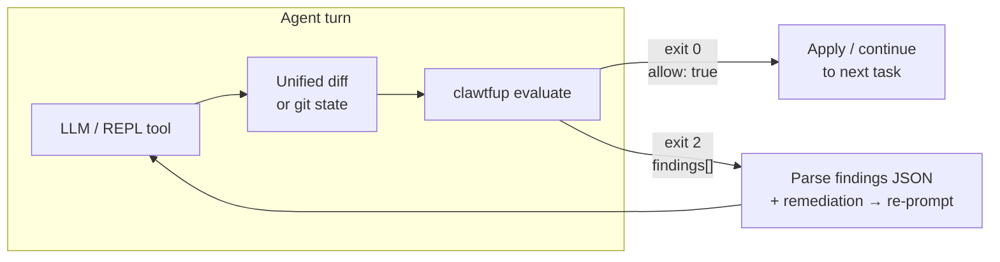

<div align="center">

|  |
|:--:|
|  |

### clawtfup

*Open claws. Closed loopholes.*

[](https://www.python.org/downloads/)
[](LICENSE)
[](https://www.openpolicyagent.org/)
[](https://claude.ai/code)

**Workspace in. Unified diff in. JSON verdict out.**

OPA evaluates your full tree plus proposed edits—your Rego, your feedback copy, one stdout report.
Wire it as a post-hook on any agent turn and your LLM never ships a policy violation silently again.

[AGENTS.md](AGENTS.md) · [Bundled policies](.clawtfup/policies/README.md)

</div>

---

## Why clawtfup

LLM agents and REPL tools (Claude Code, Cursor, Aider, custom runners) are fast—but they have no intrinsic awareness of your repo's architectural layering rules, security invariants, or syntactic constraints. They'll generate code that works in isolation and silently violates the conventions that hold your codebase together.

**clawtfup** is the hook layer that closes that gap. You define policy once in Rego; the tool enforces it on every agent turn:

- **Semantic constraints** — e.g. no DB queries in view layers, no circular imports across bounded contexts
- **Security invariants** — e.g. no unchecked dynamic code execution, no pickle, no raw SQL f-strings, no TLS verify disabled
- **Syntactic rules** — e.g. Python 2 syntax leakage, mutable default arguments, dangerous patterns
- **Your own rules** — `.clawtfup/policies/rego/*.rego` is yours; write any constraint OPA can express

The feedback loop is tight: exit **2** hands findings back to the agent with remediation text so the next turn knows exactly what to fix, not just that something failed.

---

## How it fits in a hook architecture



**Pre-hook vs post-hook.** clawtfup runs *after* the model proposes edits and *before* they land on disk or merge. That makes it a **post-LLM / pre-apply hook**—the natural enforcement point. You can also run it in CI as a **pre-merge gate**, catching anything that slipped through local hooks.

```
┌────────────────────────────────────────────────────┐
│  Agent orchestrator (Claude Code, Cursor, custom)  │
│                                                    │
│  pre-hook     → validate task / context            │
│  [LLM turn]   → generate edits                     │
│  post-hook    → clawtfup evaluate ← you are here   │
│  on exit 0    → apply / commit / continue          │
│  on exit 2    → feed findings back, re-run turn    │
└────────────────────────────────────────────────────┘
```

---

## At a glance

| | |
|:---|:---|
| **Indexes** | Text files under project root (committed tree via git or disk walk). |
| **Applies** | Unified diff (`--diff-file`, stdin, or default `git diff HEAD`) to produce the proposed file state. |
| **Evaluates** | Your `.clawtfup/policies/` Rego bundle via OPA against the full workspace. |
| **Enriches** | Findings with `.clawtfup/feedback/` remediation text and references. |
| **Default scan** | **Full tree**—committed code is in scope, not only touched lines. Use `--diff-only` when you intentionally want a narrower check. |
| **Strict mode** | Exit **2** if `allow` is false or any error-level finding—unless `--no-strict`. |

---

## Install

```bash
pip install -e .
```

You also need **OPA** on `PATH` or a binary at **`tools/opa`**. **Git** is expected if you rely on the default `git diff HEAD`.

---

## Quickstart

Run from the **repository root** (or pass `--workspace`):

```bash
clawtfup evaluate --pretty
```

**Pass:** exit **0**, JSON with `"allow": true` and no error-severity `findings[]`.

**Fail:** exit **2** (strict). Read `findings[]`, use `feedback.remediation` when present, fix application code, run again.

Pipe a **unified diff** directly (no git state needed):

```bash
clawtfup evaluate --diff-file - --pretty < proposed.patch
```

---

## Wiring into agents and REPL tools

###  Claude Code

[](https://docs.anthropic.com/en/docs/claude-code/hooks)
[](https://docs.anthropic.com/en/docs/claude-code/hooks)
[](https://docs.anthropic.com/en/docs/claude-code)

clawtfup ships **protocol-aware hook commands** that speak the Claude Code hook JSON protocol natively. Unlike a raw shell command, they read the hook event from stdin, evaluate the workspace, and return a structured response Claude Code understands—blocking the turn, injecting context, or silently passing.

#### Setup

The hooks delegate to shell scripts that handle both venv and global installs. Copy the three files below into your project exactly as shown.

**`.claude/settings.json`**

```json
{
  "hooks": {
    "PostToolUse": [
      {
        "matcher": "",
        "hooks": [
          {
            "type": "command",
            "command": "\"$CLAUDE_PROJECT_DIR\"/.claude/hooks/clawtfup-post-tool-use.sh"
          }
        ]
      }
    ],
    "UserPromptSubmit": [
      {
        "hooks": [
          {
            "type": "command",
            "command": "\"$CLAUDE_PROJECT_DIR\"/.claude/hooks/clawtfup-user-prompt-submit.sh"
          }
        ]
      }
    ]
  }
}
```

> **`"matcher": ""`** matches every tool without exception—`Edit`, `Write`, `MultiEdit`, `Bash`, `NotebookEdit`, and any future tools. Narrowing the matcher creates blind spots.

**`.claude/hooks/clawtfup-post-tool-use.sh`** (chmod +x)

```bash
#!/usr/bin/env bash
set -euo pipefail
ROOT="${CLAUDE_PROJECT_DIR:-}"
if [[ -z "$ROOT" ]]; then exit 0; fi
cd "$ROOT" || exit 0
if [[ -x .venv/bin/python ]]; then
  exec .venv/bin/python -m policy_eval hook-post-tool-use
fi
if command -v clawtfup >/dev/null 2>&1; then
  exec clawtfup hook-post-tool-use
fi
exit 0
```

**`.claude/hooks/clawtfup-user-prompt-submit.sh`** (chmod +x)

```bash
#!/usr/bin/env bash
set -euo pipefail
ROOT="${CLAUDE_PROJECT_DIR:-}"
if [[ -z "$ROOT" ]]; then exit 0; fi
cd "$ROOT" || exit 0
if [[ -x .venv/bin/python ]]; then
  exec .venv/bin/python -m policy_eval hook-user-prompt-submit
fi
if command -v clawtfup >/dev/null 2>&1; then
  exec clawtfup hook-user-prompt-submit
fi
exit 0
```

The scripts resolve the runtime in order: **project venv** (`.venv/bin/python`) → **global `clawtfup`** on `PATH`. If neither is found they exit 0 silently, so the hooks are safe to commit to repos where clawtfup isn't yet installed.

```bash
chmod +x .claude/hooks/clawtfup-post-tool-use.sh \
         .claude/hooks/clawtfup-user-prompt-submit.sh
```

#### How the hooks work

**`clawtfup hook-post-tool-use`** 

Fires after every tool call. The hook reads the Claude Code event JSON from stdin (which supplies the working directory), runs `clawtfup evaluate` against that workspace, and responds with a decision:

- **Policy pass** → returns empty stdout, exit 0. The tool call proceeds normally.
- **Policy fail** → returns a JSON block with `"decision": "block"` and a compact findings summary injected into `additionalContext`. Claude Code pauses the turn and shows the agent the violations. The agent receives remediation text and fixes the code before the turn resumes.

```
POST TOOL USE (Edit/Write)
        │
        ▼
clawtfup hook-post-tool-use ──reads stdin event──▶ runs evaluate
        │
        ├── pass  ──▶ empty stdout, exit 0  ──▶ Claude continues
        │
        └── fail  ──▶ {"decision":"block","hookSpecificOutput":
                        {"additionalContext":"<findings + remediation>"}}
                       Claude pauses, agent reads findings, re-edits
```

**`clawtfup hook-user-prompt-submit`** 

Fires at the start of every user prompt, before the model responds. It evaluates the current workspace and injects a single-line summary into the agent's context window via `additionalContext`. It **never blocks**:

- **Workspace clean** → `"clawtfup: evaluate passed … run clawtfup evaluate --pretty before finishing."`
- **Workspace dirty** → `"clawtfup: evaluate FAILS. Fix before adding more changes."` followed by a compact findings list.

This keeps the agent continuously aware of the policy state without interrupting the user's message. If the agent enters a broken workspace, it knows before it writes a single line of code.

#### Protocol detail

Both commands write JSON to stdout using the [Claude Code hook output format](https://docs.anthropic.com/en/docs/claude-code/hooks). The payload shape for a block:

```json
{
  "decision": "block",
  "reason": "clawtfup: policy failed (1 error)",
  "suppressOutput": true,
  "hookSpecificOutput": {
    "additionalContext": "- [SQL_FSTRING_QUERY] SQL query built with f-string interpolation (src/db/queries.py)\n  → Use parameterised queries..."
  }
}
```

`additionalContext` is capped at 10 000 characters and lists at most 6 findings so it never saturates the model's context window. Both hooks skip silently (exit 0, no output) when `.clawtfup/policies/` does not exist in the workspace—safe to commit to repos that don't yet use clawtfup.

#### CLI proxy (transparent agent wrapping) 

For scripted orchestration or environments where you launch Claude Code programmatically, clawtfup can act as a **transparent subprocess relay**:

```bash
clawtfup cli --provider claude -- --dangerously-skip-permissions -p "Fix the auth layer"
```

This spawns the `claude` binary (or `$CLAWTFUP_CLAUDE_BIN`) with the given arguments and relays all I/O transparently. On a real terminal it opens a PTY—giving the child process full TUI support with terminal size syncing and signal forwarding (including `SIGWINCH`). In a non-TTY context (pipes, CI, scripted runners) it falls back to a three-thread pipe relay for clean stdout/stderr separation.

Policy enforcement in this mode still comes from the `.claude/settings.json` hooks above—the proxy only relays I/O and returns the child's exit code unchanged.

```bash
# Override the Claude binary
CLAWTFUP_CLAUDE_BIN=/usr/local/bin/claude clawtfup cli --provider claude -- --help
```

Or use the bundled slash command at `.claude/commands/noshit.md` which wraps any task description and enforces the gate before marking the task complete.

### Cursor / Aider / custom runners []()

Any runner that can shell out after a model turn can integrate clawtfup:

```bash
# After applying model edits to disk
clawtfup evaluate --pretty
if [ $? -ne 0 ]; then
  # Extract findings and re-prompt
  clawtfup evaluate --pretty | jq '.findings[] | {code, message, remediation: .feedback.remediation}'
fi
```

### Integration patterns

| Pattern | Command | When to use |
|:--------|:--------|:------------|
| **Stdin patch** | `clawtfup evaluate --diff-file - --pretty < patch` | Agent emits a unified diff before touching disk. |
| **Git after apply** | `clawtfup evaluate --pretty` | Agent edits files; default `git diff HEAD` captures them. |
| **Saved diff file** | `clawtfup evaluate --diff-file /tmp/p.patch --pretty` | Diff written to temp file by orchestrator. |
| **CI gate** | `clawtfup evaluate` (no `--pretty`) | GitHub Actions / pre-merge; exit code drives pass/fail. |
| **Prefix scan** | `clawtfup evaluate --scan-prefix src/api --pretty` | Large monorepo; gate only the changed bounded context. |

### Hook contract

- Parse **stdout only** as JSON; stderr is for humans and fatal errors.
- Exit **2** → load `findings[]`, feed each `message` and `feedback.remediation` into the next model turn, repeat until exit **0** or the user aborts.
- **Never pass `--no-strict` in automated hooks.** That flag is for humans inspecting a denied report, not for agents avoiding policy fixes.
- For very large repos, `--scan-prefix` narrows scope deliberately; `--diff-only` weakens coverage—document whichever you choose so agents can't silently exploit it.

---

## JSON output

```jsonc
{
  "schema_version": 1,
  "evaluation_id": "3f2a1b4c-...",
  "timestamp": "2025-11-01T12:34:56.789012+00:00",
  "duration_ms": 142,
  "allow": false,
  "findings": [
    {
      "code": "SQL_FSTRING_QUERY",
      "severity": "error",
      "message": "SQL query built with f-string interpolation",
      "path": "src/db/queries.py",
      "feedback": {
        "title": "SQL injection via f-string query",
        "remediation": "Use parameterised queries. Pass bound parameters via the DB API, never via string formatting.",
        "references": ["https://docs.python.org/3/library/sqlite3.html"]
      }
    }
  ],
  "summary": { "by_severity": { "error": 1 } },
  "inputs": {
    "workspace": "/absolute/path/to/project",
    "policy_bundle": "/absolute/path/to/.clawtfup/policies",
    "opa_data_dir": "/absolute/path/to/.clawtfup/policies/rego",
    "changed_paths": ["src/db/queries.py"],
    "change_source": "git_head",
    "scan_mode": "full_tree",
    "scan_prefix": null,
    "index_baseline": "git_head",
    "patch_stats": { "bytes": 312, "lines": 14 },
    "merged_input_sources": [],
    "index_warnings": [],
    "skipped_binary_count": 0,
    "skipped_large_count": 0
  },
  "results": { "data.code_edits.report": { "allow": false, "violations": ["..."] } },
  "engine": { "opa_version": "0.68.0", "queries": ["data.code_edits.report"] },
  "query_errors": []
}
```

### Envelope fields

| Field | Always present | Meaning |
|:------|:--------------|:--------|
| `schema_version` | yes | Integer; currently `1`. |
| `evaluation_id` | yes | UUID v4 per run; use for log correlation. |
| `timestamp` | yes | RFC 3339 UTC start time. |
| `duration_ms` | yes | Wall time of the full evaluation. |
| `allow` | when `findings_query` set | `true` = clean; `false` = policy denied. |
| `findings[]` | when violations exist | See table below. |
| `summary.by_severity` | when findings exist | Count of findings per severity string. |
| `inputs` | yes | Metadata about what was evaluated (see below). |
| `results` | yes | Raw OPA output keyed by query string. |
| `engine` | yes | `opa_version` and `queries` list. |
| `query_errors[]` | on OPA failure | `{query, error}` objects. Never treat as pass. |

### `inputs` sub-fields

| Field | Meaning |
|:------|:--------|
| `workspace` | Absolute path to the project root. |
| `policy_bundle` | Absolute path to the policies directory. |
| `opa_data_dir` | Path passed to `opa eval -d` (usually `policies/rego/`). |
| `changed_paths` | Paths in scope for this evaluation. |
| `change_source` | `git_head` / `diff_file` / `stdin`. |
| `scan_mode` | `full_tree` / `diff_only` / `prefix`. |
| `scan_prefix` | Value of `--scan-prefix`, or `null`. |
| `index_baseline` | `git_head` (committed tree) or `working_tree` (disk walk). |
| `patch_stats` | `{bytes, lines}` of the applied diff. |
| `merged_input_sources` | Files merged via `--input-json` (for audit). |
| `index_warnings` | Paths that triggered indexing warnings (e.g. read errors). |
| `skipped_binary_count` | Files skipped because they appeared binary. |
| `skipped_large_count` | Files skipped for exceeding `--max-file-bytes`. |

### `findings[]` fields

| Field | Meaning |
|:------|:--------|
| `code` | Stable identifier; maps to feedback YAML keys. |
| `severity` | `"error"` fails strict mode; `"warning"` does not. |
| `message` | Short explanation from Rego. |
| `path` | Relative POSIX path when rule is file-scoped; `""` for global checks. |
| `feedback` | `title`, `remediation`, `references` when configured in feedback YAML. |

---

## Built-in policy coverage

The bundled Rego ruleset (`.clawtfup/policies/rego/`) covers:

🔴 **Security — exit 2**
- Code execution: unchecked builtins that run code, implicit-shell process helpers, unchecked dynamic imports
- Serialisation: `pickle`, `marshal`, unsafe `yaml.load`
- Injection: SQL f-string queries, SSTI via `render_template_string`, open redirects
- Auth / transport: TLS verify disabled, JWT verify disabled, CSRF, insecure cookies, CORS misconfig
- Secrets: AWS keys, API tokens, passwords in comments or code

🔴 **Portability — exit 2**
- Python 2 syntax leakage: legacy print form, comma-style except binding, Py2 dict helpers and text types, old octal forms without the modern prefix, long-integer suffixes, and related holdovers

🟡 **Design — warnings**
- Anti-patterns: indexing via **range** over **len**(sequence), mutable default arguments, `global` in functions, bare `except: pass` on `ImportError`
- Threading: daemon thread creation, unsafe hash in dataclasses
- LBYL: `os.path.exists` before open instead of EAFP

🟡 **Architecture — warnings**
- Database calls in view/route layers
- Circular import patterns

🟡 **Style — warnings**
- Lines > 120 characters, leading/trailing tabs

All rules are overridable or replaceable—`.clawtfup/` is yours.

---

## CLI reference

clawtfup exposes four top-level subcommands:

| Subcommand | Purpose |
|:-----------|:--------|
| `clawtfup evaluate [options]` | 🔍 Run policy evaluation; the primary command for agents and CI. |
| `clawtfup hook-post-tool-use` | 🟢 Claude Code PostToolUse hook handler. Reads hook JSON from stdin; blocks on policy failure. |
| `clawtfup hook-user-prompt-submit` | 🔵 Claude Code UserPromptSubmit hook handler. Injects ambient evaluation context; never blocks. |
| `clawtfup cli --provider NAME [-- args…]` | 🔀 Transparent agent CLI proxy. Spawns the named agent (e.g. `claude`) with full I/O relay. |

### `clawtfup evaluate`

```text
clawtfup evaluate [options]
```

<details>
<summary><strong>All flags</strong></summary>

| Flag | Default | Effect |
|:-----|:--------|:-------|
| `--workspace DIR` | cwd | Project root; policies expected at `<workspace>/.clawtfup/policies/`. |
| `--diff-file PATH\|-` | — | Unified diff file or stdin (`-`). Overrides default `git diff HEAD`. |
| `--diff-only` | off | Run policy only on diff-touched paths. Weaker than full-tree; use deliberately. |
| `--scan-prefix PATH` | — | Only index and evaluate under this relative path (e.g. `src/api`). |
| `--input-json PATH` | — | JSON file deep-merged into OPA input after the built-in fragment. |
| `--query Q` | manifest | Repeatable. Override OPA queries from `policy_eval.yaml`. |
| `--max-files N` | 10 000 | Indexing cap; `0` = no cap. |
| `--max-file-bytes N` | 524 288 | Skip files larger than N bytes; `0` = no cap. |
| `--exclude-glob G` | — | Repeatable `fnmatch` on workspace-relative paths. |
| `--no-gitignore` | off | Index paths `.gitignore` would hide. |
| `--pretty` | off | Pretty-print JSON output. |
| `--no-strict` | off | Exit 0 even on deny or error findings. **Not for agents.** |

**Exit codes:** `0` = strict pass · `2` = policy denial or error findings · other = bad input, bundle, or OPA failure.

</details>

### `clawtfup hook-post-tool-use`

Reads a Claude Code hook event object from stdin. Resolves the workspace from the event's `cwd` field, runs `clawtfup evaluate`, and writes a Claude Code hook response to stdout:

- **Pass** → empty stdout, exit 0.
- **Fail** → JSON with `"decision": "block"`, a short reason string, and up to 6 compact findings in `hookSpecificOutput.additionalContext`.

No flags. Exits 0 silently when `.clawtfup/policies/` does not exist.

### `clawtfup hook-user-prompt-submit`

Same stdin protocol as above. Always exits 0 and never sets `decision: block`. Injects a one-line workspace status plus findings (on failure) into `hookSpecificOutput.additionalContext`.

No flags. Exits 0 silently when `.clawtfup/policies/` does not exist.

### `clawtfup cli --provider NAME`

```text
clawtfup cli --provider claude [--workspace DIR] [-- agent-args…]
```

| Flag | Default | Effect |
|:-----|:--------|:-------|
| `--provider NAME` | required | Agent name. Currently `claude` (maps to the `claude` binary). |
| `--workspace DIR` | cwd | Workspace root; validated against `.clawtfup/policies/`. |
| `--` | — | Separator; everything after is forwarded verbatim to the agent binary. |

**Binary resolution order:** `--` argument → `$CLAWTFUP_CLAUDE_BIN` env var → `claude` on `PATH`.

**I/O mode selection:**
- Stdin is a real TTY (interactive terminal) → PTY mode: opens a pseudo-terminal, syncs window size, forwards `SIGWINCH`, relays raw bytes. Full TUI support.
- Stdin is not a TTY (pipe, CI, script) → pipe mode: three relay threads for stdin, stdout, and stderr. Clean separation; no PTY overhead.

Returns the child process exit code unchanged.

---

## Controlling scope

Policy only sees **indexed** files. Exclusions are applied at indexing time, not in Rego.

| Mechanism | Behaviour |
|:----------|:----------|
| `.gitignore` | **On by default.** Excluded files are not indexed. |
| `--no-gitignore` | Disable that filter (expect noise without other narrowing). |
| `--exclude-glob G` | Shell-style globs on relative paths; repeatable. |
| `--scan-prefix PATH` | Index and evaluate only one subtree. |
| Always skipped | `.git/` and `.clawtfup/` are never treated as product source. |

---

## Policy and feedback layout

```
.clawtfup/
├── policies/
│   ├── policy_eval.yaml          # OPA queries + optional findings_query
│   └── rego/
│       └── *.rego                # Policy rules (yours to extend or replace)
└── feedback/
    └── *.{yaml,yml,json}         # Remediation text keyed by violation code
```

**`policy_eval.yaml`** minimum shape:

```yaml
queries:
  - data.code_edits.report
findings_query: data.code_edits.report
```

**`feedback/`** entry shape:

```yaml
SQL_FSTRING_QUERY:
  severity: error
  title: SQL injection via f-string query
  remediation: Use parameterised queries. Pass bound parameters via the DB API.
  references:
    - https://docs.python.org/3/library/sqlite3.html
```

---

## Python API

```python
from pathlib import Path
from policy_eval import (
    EvaluateOptions,
    evaluate,
    ManifestError,
    OpaEngineError,
    PatchApplyError,
    PolicyEvalError,
)

try:
    report = evaluate(
        EvaluateOptions(
            workspace=Path("/path/to/project"),
            bundle_root=Path("/path/to/project/.clawtfup/policies"),
            patch_text="",            # empty string → uses git diff HEAD
            change_source="git_head",
            index_from_git_head=True,
            full_scan=True,           # full_tree mode (default CLI behaviour)
        )
    )
except ManifestError as e:
    # policy_eval.yaml missing or malformed
    raise
except PatchApplyError as e:
    # unified diff did not apply cleanly (context mismatch)
    raise
except OpaEngineError as e:
    # OPA binary not found or returned non-zero
    raise
except PolicyEvalError as e:
    # catch-all for other evaluation errors
    raise

if not report["allow"]:
    for f in report["findings"]:
        remediation = (f.get("feedback") or {}).get("remediation", "")
        print(f["code"], f["severity"], f["message"])
        if remediation:
            print("  →", remediation)
```

`full_scan=True` mirrors the default CLI. Set `full_scan=False` for diff-only evaluation.

**Custom OPA binary path** — if OPA is not on `PATH` and not at `tools/opa`, pass it explicitly:

```python
EvaluateOptions(
    ...
    opa_binary="/opt/homebrew/bin/opa",
)
```

The CLI resolves OPA automatically (`tools/opa` → system `PATH`); the `opa_binary` field is Python API only.

---

## Writing your own policies

Everything under `.clawtfup/` is yours to extend. The bundled ruleset is a starting point.

### OPA input contract

clawtfup builds the following document and passes it to every query. Your Rego can reference any field.

```
input.workspace.root              # absolute path to workspace root
input.workspace.files_before      # map: relative path → content before patch
input.workspace.files_after       # map: relative path → content after patch
input.workspace.changed_paths     # list of relative POSIX paths touched by the diff
input.workspace.combined_after    # all changed-file contents concatenated (fast for global checks)
input.change.text                 # raw unified diff text
input.requirements.must_contain   # caller-supplied strings that combined_after must include
input.requirements.must_not_contain
input.policy.enforce_anchor_on_changed_python  # bool; requires sentinel comment per .py file
```

### Violation object shape

Each rule emits a `violation` with these fields:

| Field | Type | Notes |
|:------|:-----|:------|
| `code` | string | Stable identifier. Must match a `feedback.yaml` key to get remediation text. |
| `message` | string | Short explanation shown to the agent on failure. |
| `severity` | string | `"error"` triggers exit 2 in strict mode; `"warning"` does not. |
| `path` | string | Relative POSIX path for file-scoped rules; `""` for global/combined checks. |

### Minimal example rule

```rego
# Global check — fires if the pattern appears anywhere in changed content
violation contains {
    "code":     "NO_HARDCODED_HOST",
    "message":  "Do not hardcode hostnames; read from environment or config.",
    "path":     "",
    "severity": "warning",
} if {
    regex.match(`https?://[a-z0-9.-]+\.[a-z]{2,}`, input.workspace.combined_after)
}
```

```rego
# Path-scoped check — fires only for files under api/
violation contains {
    "code":     "DB_IN_API_LAYER",
    "message":  "Database access must not appear in the API layer; use a service module.",
    "path":     path,
    "severity": "error",
} if {
    some path in input.workspace.changed_paths
    regex.match(`^api/`, path)
    contains(input.workspace.files_after[path], "db.session")
}
```

Add the matching feedback entry in `.clawtfup/feedback/feedback.yaml`:

```yaml
NO_HARDCODED_HOST:
  severity: warning
  title: Hardcoded hostname detected
  remediation: >
    Move hostnames to environment variables (os.environ["SERVICE_HOST"]) or a
    structured config object. Never inline them in source code.
```

Full policy authoring guide: **[.clawtfup/policies/README.md](.clawtfup/policies/README.md)**

---

## Indexing baseline

The workspace index uses different baselines depending on the diff source:

| Diff source | Index baseline | Why |
|:------------|:--------------|:----|
| Default (`git diff HEAD`) | **git HEAD** + untracked files | Ensures the index matches what git considers committed; consistent across checkouts. |
| `--diff-file PATH` or stdin | **Disk walk** (working tree) | No git context assumed; reads files as they exist on disk at evaluation time. |

This matters when you have uncommitted files you want policy to see: with the default git source they appear as untracked and are indexed; with an explicit diff file the full working tree is indexed instead.

---

## Agent rules (summary)

Full spec: **[AGENTS.md](AGENTS.md)**

1. Run `clawtfup evaluate --pretty` before treating any coding task as done.
2. Treat stdout JSON as source of truth; never use `--no-strict` to avoid fixing violations.
3. Fix **application code** to satisfy policy—do not weaken `.clawtfup/` unless the user explicitly asked.
4. If the binary is missing, fix the environment (`pip install -e .`, OPA on `PATH`), then re-run.

---

## Further reading

- [AGENTS.md](AGENTS.md) — mandatory agent behaviour in this repository
- [.clawtfup/policies/README.md](.clawtfup/policies/README.md) — bundled rule set
- [pyproject.toml](pyproject.toml) — distribution name `clawtfup`, import package `policy_eval`
